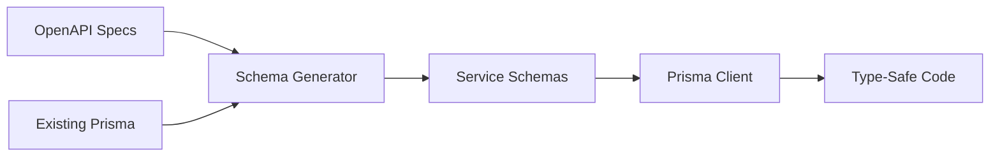

# Contract-First Schema Generation Strategy

**Created**: 2025-08-20  
**Status**: ARCHITECTURAL DECISION  
**Priority**: CRITICAL  

## Executive Summary

We're implementing TRUE contract-first development where OpenAPI specifications drive Prisma schema generation, not the other way around. This ensures API contracts are the source of truth, with database schemas derived from them.

## The Problem We're Solving

1. **Current State**: 1,330 line monolithic Prisma schema with 60+ models
2. **Challenge**: Need to split into microservices with separate databases
3. **Risk**: Manual splitting is error-prone and violates contract-first principles
4. **Insight**: OpenAPI specs should drive database schemas, not vice versa

## The Contract-First Principle

```
OpenAPI Spec (Contract) → Prisma Schema → Database
       ↑                        ↓
    SOURCE OF TRUTH      Generated Artifact
```

NOT:
```
Database → Prisma Schema → OpenAPI Spec
    ↑           ↓              ↓
  WRONG!   Source of Truth?  Afterthought
```

## Our Approach: Hybrid Generation

### 1. Sources of Truth

#### Primary: OpenAPI Specifications
- `/openapi/financial.yaml` - 130KB of contract definitions
- `/openapi/trading.yaml` - 31KB of trading contracts  
- `/openapi/ai-core.yaml` - 27KB of AI service contracts
- `/openapi/comm.yaml` - 36KB of communication contracts

#### Secondary: Existing Schema Optimizations
- Database indexes
- Relations between models
- Performance optimizations
- Constraints and validations

### 2. Generation Pipeline



### 3. Implementation Strategy

#### Phase 1: Analyze OpenAPI Models
```yaml
# Example from financial.yaml
components:
  schemas:
    Client:
      type: object
      properties:
        id:
          type: string
          format: uuid
        name:
          type: string
        email:
          type: string
          format: email
```

#### Phase 2: Generate Base Prisma Schema
```prisma
model Client {
  id    String @id @default(uuid())
  name  String
  email String @unique
}
```

#### Phase 3: Enrich with Database Knowledge
```prisma
model Client {
  id        String   @id @default(uuid())
  name      String
  email     String   @unique
  createdAt DateTime @default(now())
  updatedAt DateTime @updatedAt
  
  @@index([email])  // From existing schema
}
```

## Benefits of This Approach

### 1. Contract Compliance
- Database always matches API specification
- No drift between API and database
- Changes start in OpenAPI, cascade to database

### 2. Type Safety
- OpenAPI → TypeScript types for API
- Prisma → TypeScript types for database
- Both generated from same source

### 3. Microservices Ready
- Each service has its own OpenAPI spec
- Each service generates its own schema
- Clear boundaries enforced by contracts

### 4. Developer Experience
- No manual schema writing
- Consistent patterns across services
- Single source of truth

## Tools and Technologies

### Required NPM Packages
```json
{
  "devDependencies": {
    "@apidevtools/swagger-parser": "^10.1.0",
    "openapi-typescript": "^6.7.0",
    "prisma": "^6.13.0",
    "@prisma/generator-helper": "^6.13.0"
  }
}
```

### Custom Generation Script
Location: `/scripts/generate-prisma-from-openapi.js`

```javascript
const SwaggerParser = require('@apidevtools/swagger-parser');
const { generatePrismaSchema } = require('./utils/prisma-generator');

async function generateServiceSchema(serviceName) {
  // 1. Parse OpenAPI
  const api = await SwaggerParser.parse(`openapi/${serviceName}.yaml`);
  
  // 2. Extract models from components.schemas
  const models = extractModels(api.components.schemas);
  
  // 3. Enrich with existing schema knowledge
  const enrichedModels = enrichModels(models, serviceName);
  
  // 4. Generate Prisma schema
  const schema = generatePrismaSchema(enrichedModels);
  
  // 5. Write to service directory
  fs.writeFileSync(
    `apps/${serviceName}/prisma/schema.prisma`,
    schema
  );
}
```

## Migration Path

### Step 1: Validate OpenAPI Specs (30 min)
```bash
npx @apidevtools/swagger-cli validate openapi/*.yaml
```

### Step 2: Generate Service Schemas (1 hour)
```bash
node scripts/generate-prisma-from-openapi.js financial-svc
node scripts/generate-prisma-from-openapi.js trading-svc
node scripts/generate-prisma-from-openapi.js ai-core
node scripts/generate-prisma-from-openapi.js comm-svc
```

### Step 3: Deploy to Databases (30 min)
```bash
# For each service
cd apps/financial-svc && npx prisma migrate deploy
cd apps/trading-svc && npx prisma migrate deploy
cd apps/ai-core && npx prisma migrate deploy
cd apps/comm-svc && npx prisma migrate deploy
```

### Step 4: Generate Prisma Clients (15 min)
```bash
# For each service
cd apps/financial-svc && npx prisma generate
cd apps/trading-svc && npx prisma generate
cd apps/ai-core && npx prisma generate
cd apps/comm-svc && npx prisma generate
```

## Validation Criteria

### 1. Schema Validation
- [ ] All OpenAPI models have corresponding Prisma models
- [ ] All required fields are marked as required
- [ ] Data types match between OpenAPI and Prisma
- [ ] Relationships are properly defined

### 2. Database Validation
- [ ] Migrations run without errors
- [ ] Indexes are created
- [ ] Constraints are enforced
- [ ] Foreign keys work (within service boundary)

### 3. Type Validation
- [ ] TypeScript compiles without errors
- [ ] Generated types match API contracts
- [ ] No type mismatches

## Common Patterns

### Cross-Service References
```prisma
model Invoice {
  id       String @id
  userId   String // Reference to auth service
  clientId String // Local reference
  
  client   Client @relation(fields: [clientId], references: [id])
  // No @relation for userId - different service
}
```

### Enum Handling
```yaml
# OpenAPI
status:
  type: string
  enum: [draft, sent, paid]
```

```prisma
# Prisma
status String @default("draft") // Use validation in app layer
```

### Timestamps
Always add these even if not in OpenAPI:
```prisma
createdAt DateTime @default(now())
updatedAt DateTime @updatedAt
```

## Anti-Patterns to Avoid

### ❌ Database-First Design
Don't design database then create API

### ❌ Manual Schema Writing
Don't hand-write what can be generated

### ❌ Shared Models Across Services
Each service owns its models completely

### ❌ Direct Database Access
Services must use their own database only

## Success Metrics

1. **Time to Generate**: < 2 hours for all services
2. **Schema Accuracy**: 100% match with OpenAPI
3. **Type Safety**: 0 TypeScript errors
4. **Database Isolation**: Each service has own DB
5. **API Compliance**: All endpoints match contracts

## Future Enhancements

### 1. Continuous Integration
```yaml
# .github/workflows/schema-sync.yml
on:
  push:
    paths:
      - 'openapi/*.yaml'
jobs:
  regenerate-schemas:
    steps:
      - run: npm run generate:schemas
      - run: npm run test:schemas
```

### 2. Schema Versioning
Track schema versions for safe migrations

### 3. Documentation Generation
Generate docs from OpenAPI + Prisma

## Conclusion

Contract-first schema generation ensures:
- API specifications drive database design
- Type safety from API to database
- Clear service boundaries
- Automated, reproducible process
- Single source of truth

This is the foundation for TRUE microservices architecture.