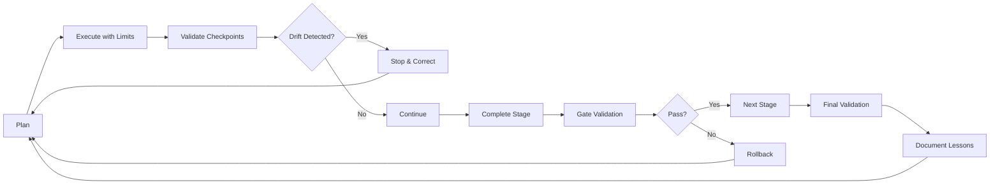

# Agent Validation Framework & Lessons Learned

## 🎯 Executive Summary

After the 60+ agent orchestration experience, we've learned critical lessons about horizontal scaling, coordination overhead, and architectural drift. This framework ensures future agent operations avoid these pitfalls.

## 📚 Key Lessons from Operation Lightning

### Lesson 1: Horizontal Scaling Has Limits
**What Happened**: 60+ agents created more chaos than progress
**Root Cause**: Coordination overhead exceeded productivity gains after ~15 agents
**Solution**: Hierarchical coordination with max 15 agents per tier

### Lesson 2: Architecture Can't Be Parallelized
**What Happened**: Distributed monolith created instead of microservices
**Root Cause**: Fundamental architectural decisions were made in parallel
**Solution**: Sequential architecture stages with validation gates

### Lesson 3: Success Theater vs Real Success
**What Happened**: "100% complete" but fundamental issues remained
**Root Cause**: Activity metrics instead of outcome metrics
**Solution**: Measure architecture fitness, not task completion

### Lesson 4: Drift Happens Fast
**What Happened**: Original plan abandoned within first hour
**Root Cause**: No checkpoints or drift detection
**Solution**: 2-hour checkpoints with automatic rollback triggers

## 🛡️ Validation Framework

### Pre-Execution Validation

```yaml
before_spawning_agents:
  required_artifacts:
    - architecture_decision_record.md
    - service_boundaries.yaml
    - api_contracts.yaml
    - database_strategy.md
  
  validation_checks:
    - no_shared_database
    - bounded_contexts_defined
    - async_communication_planned
    - rollback_strategy_exists
  
  max_agents_allowed:
    without_validation: 3
    with_validation: 15
    with_hierarchical_coordination: 50
```

### During Execution Validation

```yaml
every_2_hours:
  mandatory_checks:
    - architecture_drift_score < 20
    - no_anti_patterns_detected
    - contracts_still_valid
    - performance_baseline_maintained
  
  on_failure:
    - stop_all_agents
    - assess_damage
    - decide_rollback_or_fix
    - document_lessons
```

### Post-Execution Validation

```yaml
before_marking_complete:
  technical_checks:
    - all_tests_passing
    - zero_typescript_errors
    - contracts_enforced
    - deployable_independently
  
  architecture_checks:
    - services_truly_isolated
    - no_distributed_monolith
    - event_driven_where_needed
    - monitoring_in_place
  
  business_checks:
    - features_working_e2e
    - performance_acceptable
    - security_validated
    - documentation_complete
```

## 🚨 Anti-Pattern Detection

### Critical Anti-Patterns (Block Deployment)

1. **Distributed Monolith**
   - Indicator: Shared database across services
   - Detection: Cross-schema queries, shared tables
   - Action: STOP - Redesign required

2. **Synchronous Cascade**
   - Indicator: Service A → B → C → D synchronously
   - Detection: HTTP calls in chain, no async
   - Action: STOP - Add event bus

3. **Shared State**
   - Indicator: Services sharing memory/cache/session
   - Detection: Redis keys accessed by multiple services
   - Action: STOP - Isolate state

### Warning Anti-Patterns (Require Review)

1. **Chatty Services**
   - Indicator: >10 API calls for one user action
   - Detection: Trace analysis
   - Action: Review and optimize

2. **Missing Contracts**
   - Indicator: No OpenAPI/GraphQL specs
   - Detection: Contract coverage < 100%
   - Action: Generate contracts first

3. **Coupled Deployments**
   - Indicator: Must deploy services together
   - Detection: Deployment dependency graph
   - Action: Decouple before production

## 📊 Success Metrics (Real, Not Theater)

### Architecture Fitness Score

```typescript
interface ArchitectureFitness {
  serviceAutonomy: number;        // 0-100: Can deploy independently?
  dataIsolation: number;          // 0-100: No shared database?
  asyncCommunication: number;     // 0-100: Event-driven?
  contractCompliance: number;     // 0-100: APIs match contracts?
  testCoverage: number;          // 0-100: E2E, unit, integration
  performanceBaseline: number;    // 0-100: Meets SLAs?
}

// Minimum acceptable: 80/100 overall
// Any category below 60 = BLOCKED
```

### Coordination Efficiency

```typescript
interface CoordinationMetrics {
  conflictRate: number;           // Target: <5%
  mergeFailures: number;         // Target: <1%
  communicationOverhead: number;  // Target: <20% of time
  reworkRate: number;            // Target: <10%
  rollbackFrequency: number;     // Target: <1 per sprint
}
```

## 🎭 Reality Check Questions

Before claiming "complete", answer honestly:

1. **Can each service be deployed independently?**
   - If no: You have a distributed monolith

2. **Can a service fail without cascading?**
   - If no: You have tight coupling

3. **Can you scale services independently?**
   - If no: You have resource coupling

4. **Do services share a database?**
   - If yes: You have data coupling

5. **Is inter-service communication async?**
   - If no: You have temporal coupling

6. **Are contracts automatically enforced?**
   - If no: You have integration risk

7. **Can you develop services in parallel?**
   - If no: You have development coupling

8. **Is the architecture simpler than before?**
   - If no: You've added complexity without benefit

## 🔄 Continuous Improvement Loop



## 🚀 The Path Forward

### Immediate Actions
1. Choose architecture path (monolith vs true microservices)
2. Document real architecture (not wishful)
3. Fix test failures before adding features
4. Implement validation checkpoints

### This Week
1. Implement drift detection in all agent operations
2. Add architecture fitness scoring
3. Create automated rollback triggers
4. Document bounded contexts

### This Month
1. Prove one service works completely independently
2. Implement event bus if going microservices
3. Add contract testing to CI/CD
4. Train team on new validation framework

## 📝 Final Wisdom

> "60 agents working in parallel is not 60x productivity. 
> It's 60x coordination overhead with 10x productivity if you're lucky.
> True efficiency comes from clear boundaries, staged execution, 
> and continuous validation. Architecture cannot be rushed by 
> throwing more agents at it."

### Remember:
- **Quality > Quantity**: 5 good agents > 50 confused agents
- **Sequential > Parallel** for architecture decisions
- **Validation > Speed**: Slow and correct beats fast and broken
- **Reality > Claims**: Working software beats impressive documentation
- **Simplicity > Complexity**: If it's harder than before, you're doing it wrong

---

*Last Updated: After Operation Lightning disaster*
*Lesson Status: Learned the hard way*
*Application: Mandatory for all future operations*