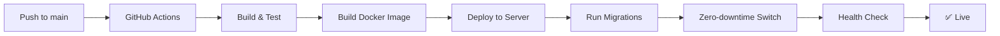

# 🚀 AI Service - Deployment Documentation

This section contains all documentation related to deploying the AI Service, including CI/CD pipelines, infrastructure configuration, and platform-specific guides.

## 📁 Structure

### [CI/CD](./cicd/)
- **[GitHub Actions](./cicd/github-actions.md)** - Automated deployment workflows
- **[Security](./cicd/security.md)** - CI/CD security best practices
- **[Setup Guide](./cicd/setup-guide.md)** - Setting up continuous deployment

### [Synology NAS](./synology/)
- **[Manual Switch](./synology/manual-switch.md)** - Manual deployment procedures
- **[Production Setup](./synology/PRODUCTION_SETUP.md)** - Production environment configuration
- **[Deployment Guide](./synology/SYNOLOGY_DEPLOYMENT.md)** - Complete Synology deployment guide
- **[Portainer Setup](./synology/PORTAINER_SETUP.md)** - Container management with Portainer

### [Docker](./docker/)
- **[Compose Cleanup](./docker/compose-cleanup.md)** - Docker Compose best practices

### [Infrastructure](./infrastructure/)
- **[Architecture](./infrastructure/architecture.md)** - Infrastructure design and architecture

### [Guides](./guides/)
- **[Deployment Procedure](./guides/deployment-procedure.md)** - Step-by-step deployment process
- **[Lessons Learned](./guides/lessons-learned.md)** - Historical deployment insights
- **[MCP Deployment](./guides/mcp-deployment.md)** - MCP Bridge deployment
- **[Production Sprint](./guides/production-sprint.md)** - Production deployment sprint guide
- **[Production Validation](./guides/production-validation.md)** - Validation procedures

### [Scripts](./scripts/)
- **[NAS Scripts](./scripts/nas-scripts.md)** - Deployment automation scripts

### [Archive](./archive/)
- **[Battle Report](./archive/battle-report.md)** - Historical deployment challenges

## **🔄 Automated Production Deployment Pipeline**

### **🔄 How it Works:**

1. **Developer pushes to `main`** → Triggers automatic deployment
2. **GitHub Actions** → Builds, tests, and validates 
3. **Zero-downtime deployment** → Deploys to production server
4. **Automatic migrations** → Database schemas updated seamlessly
5. **Health verification** → Ensures everything works
6. **✅ Live in production** → No manual intervention needed

---

## **📋 Complete Workflow**



---

## **🛠️ Commands Available**

### **Development:**
```bash
make dev                    # Start local development
make migrate-financial      # Run DB migrations locally
make test-financial         # Test financial setup
```

### **Production (Emergency only):**
```bash
make deploy-prod           # Manual production deploy
make migrate-financial-prod # Manual DB migration
```

---

## **🔧 Configuration Files**

| File | Purpose |
|------|---------|
| `.github/workflows/deploy-production.yml` | Automated deployment pipeline |
| `docker-compose.prod.yml` | Production container configuration |
| `scripts/deploy-production.sh` | Zero-downtime deployment script |
| `scripts/setup-financial-db.sh` | Database migration script |

---

## **🚨 Emergency Procedures**

### **Rollback (if needed):**
```bash
# SSH to production server
ssh anaxi@ai-service.anaxi.net

# Check recent backups
ls -la ~/ai-service-backups/

# Restore specific backup
cd ~/ai-service
./scripts/rollback-deployment.sh backup-20250107-143022
```

### **Manual Database Migration:**
```bash
# If automatic migration fails
ssh anaxi@ai-service.anaxi.net
cd ~/ai-service
ENV=production ./scripts/setup-financial-db.sh
```

### **Force Container Update:**
```bash
# If Watchtower isn't working
ssh anaxi@ai-service.anaxi.net
cd ~/ai-service
docker-compose -f docker-compose.prod.yml pull ai-service
docker-compose -f docker-compose.prod.yml up -d ai-service
```

---

## **📊 Monitoring & Verification**

### **Health Checks:**
- **Main Service:** https://ai-service.anaxi.net/status
- **Financial API:** https://ai-service.anaxi.net/api/financial/dashboard/health
- **Neural Status:** https://ai-service.anaxi.net/neural

### **Logs:**
```bash
# Production logs
ssh anaxi@ai-service.anaxi.net
cd ~/ai-service
docker-compose -f docker-compose.prod.yml logs -f ai-service

# Deployment logs
tail -f ~/ai-service-deployments.log
```

---

## **🔐 Security Features**

- ✅ **No secrets in code** - All sensitive data in secure environment files
- ✅ **Automatic backups** - Database backed up before each deployment
- ✅ **Zero-downtime** - No service interruption during updates
- ✅ **Health validation** - Automatic rollback if deployment fails
- ✅ **Audit trail** - All deployments logged with timestamps

---

## **🎯 Key Benefits**

1. **🤖 Fully Automated** - Zero manual steps for normal deployments
2. **🔄 Zero Downtime** - Users never experience service interruption  
3. **🛡️ Safe Migrations** - Database changes applied automatically and safely
4. **📸 Automatic Backups** - Can rollback instantly if needed
5. **🔍 Health Monitoring** - Deployment fails fast if something's wrong
6. **🚀 Fast Delivery** - From code push to live in under 5 minutes

---

## **📝 Troubleshooting**

### **"GitHub Actions failing"**
- Check the Actions tab in GitHub repository
- Verify all required secrets are set in repository settings
- Ensure SSH key has access to production server

### **"Database migration failed"**
- Check if production database is accessible
- Verify `.env.local` file exists on production server
- Run manual migration with detailed logging

### **"Service not responding after deployment"**
- Check container logs: `docker-compose logs ai-service`
- Verify health endpoint: `curl localhost:3000/status`
- Check database connectivity from container

### **"Financial endpoints returning errors"**
- Verify financial schema exists: Check table count
- Run migration manually if needed
- Verify GoCardless credentials in environment

---

## **📞 Support**

For deployment issues:
1. Check GitHub Actions logs
2. SSH to server and check container logs  
3. Review deployment logs at `~/ai-service-deployments.log`
4. Use emergency rollback if needed

**🎉 This deployment strategy ensures reliable, automated, zero-downtime production updates!**