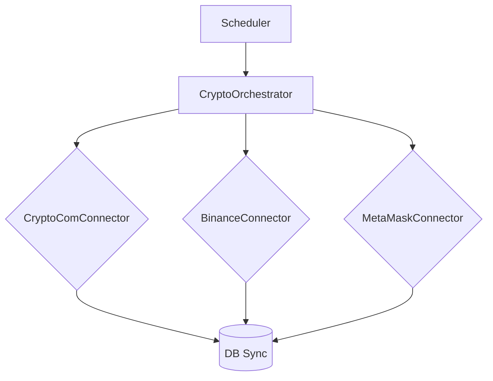

# 🌐 Estrategia de Integración con Plataformas Crypto

## 📋 Objetivo
Definir un plan escalonado para conectar el Sistema Financiero de AI Service con:
- **Crypto.com App** y **Crypto.com Exchange**
- **Binance**
- **MetaMask** (Ethereum y EVM compatibles)

## 🔧 Pasos Iniciales
1. **Revisión de APIs Disponibles**
   - Documentar capacidades REST/WebSocket de cada proveedor.
   - Identificar requisitos de autenticación (clave API, OAuth, etc.).
2. **Diseño de Módulo Conector**
   - Crear una interfaz común (`CryptoConnector`) que estandarice operaciones:
     ```typescript
     interface CryptoConnector {
       nombre: string;
       conectar(): Promise<void>;
       obtenerBalances(): Promise<CryptoBalance[]>;
       obtenerTransacciones(): Promise<CryptoTx[]>;
       ejecutarTransferencia(destino: string, monto: number, asset: string): Promise<string>;
     }
     ```
   - Implementar un adaptador por plataforma (`CryptoComConnector`, `BinanceConnector`, `MetaMaskConnector`).
3. **Almacenamiento Seguro de Credenciales**
   - Utilizar variables de entorno y secretos cifrados en la base de datos.
   - Integrar con el sistema existente de manejo de claves.

## 🚀 Fases de Implementación
### Fase 1: Conexión de Solo Lectura
- Sincronizar balances e historial de operaciones.
- Verificar límites de rate limit y políticas KYC de cada plataforma.

### Fase 2: Operaciones Básicas
- Habilitar retiros y depósitos programados.
- Mantener logs detallados de cada acción para auditoría.

### Fase 3: Integración con el Motor Financiero
- Unificar transacciones fiat y crypto en la misma base de datos.
- Generar reportes consolidados de todas las cuentas conectadas.

## 🛡️ Consideraciones de Seguridad
- Rotación periódica de claves API.
- Revisión de permisos mínimos necesarios (principio de menor privilegio).
- Almacenar firmas y hashes de transacciones para trazabilidad.

## 📈 Próximos Pasos
- [ ] Evaluar la creación de un servicio de orquestación que coordine múltiples wallets.
- [ ] Analizar costos y comisiones por cada operación en las distintas plataformas.
- [ ] Documentar en detalle las diferencias entre las APIs (formatos de fecha, paginación, etc.).

---
_Este documento servirá como guía inicial para expandir las capacidades crypto del Sistema Financiero._
## 🏗️ Diseño del Sistema de Integración
Para implementar la conexión con los exchanges y billeteras se propone un *Service Layer* con conectores desacoplados. Cada conector seguirá la interfaz `CryptoConnector` y reportará su estado al motor financiero.

### Componentes Clave
- **CryptoScheduler**: Tareas programadas para sincronizar balances y transacciones.
- **CryptoOrchestrator**: Coordina las operaciones multi-plataforma y resuelve dependencias.
- **WalletRegistry**: Registro de wallets y cuentas crypto enlazadas al usuario.

La sincronización manual puede ejecutarse con la ruta `POST /api/crypto/sync`, que dispara el `CryptoOrchestrator` con los conectores configurados en las variables de entorno.



### Flujo Básico
1. Scheduler ejecuta `syncCryptoData` cada hora.
2. Orchestrator consulta cada conector y agrega los movimientos nuevos.
3. Las transacciones se almacenan en `financial.transactions` usando los campos de blockchain ya definidos en el [Manual Técnico](TECHNICAL_MANUAL.md).

## 🪙 Detalles por Proveedor
### Crypto.com
- **Endpoint**: `https://api.crypto.com/v2`
- **Autenticación**: claves API (`api_key`, `secret_key`) con firma HMAC SHA256.
- **Recurso útil**: [Crypto.com Exchange Documentation](https://crypto.com/exchange/documentation)
- **Notas**:
  - Revisar `public/get-account-summary` para balances.
  - Los retiros requieren habilitar direcciones de whitelist previamente.

### Binance
- **Endpoint**: `https://api.binance.com`
- **Autenticación**: clave API y `signature` HMAC SHA256 con timestamp.
- **SDK sugerido**: [`@binance/connector`](https://github.com/binance/binance-connector-node)
- **Límites**:
  - `1200` requests/minute por defecto.
  - Emplear weight y control de errores `429`.

### MetaMask
- **Librería recomendada**: [`ethers`](https://github.com/ethers-io/ethers.js)
- **Conexión**: `window.ethereum.request({ method: 'eth_requestAccounts' })`
- **Consideraciones**:
  - Requiere interacción del usuario en el navegador.
  - Para transacciones programadas utilizar un servicio custodial o script firmado offline.

## 🔑 Variables de Entorno
Agrega las siguientes variables al `.env` de producción:

```dotenv
# === CRYPTO INTEGRATIONS ===
CRYPTOCOM_API_KEY=your-crypto-com-key
CRYPTOCOM_SECRET_KEY=your-crypto-com-secret
BINANCE_API_KEY=your-binance-api-key
BINANCE_SECRET_KEY=your-binance-secret-key
METAMASK_PRIVATE_KEY=your-metamask-key    # Opcional para scripts backend
```

Estas claves deben almacenarse usando el gestor de secretos y nunca en código fuente.

## 📝 Plan Detallado Paso a Paso
1. **Investigación Profunda**
   - Revisar ejemplos de código de cada proveedor y definir el mapeo de campos.
2. **Implementar `CryptoConnector` y adaptadores**
   - Crear carpeta `src/crypto-connectors/` con una clase por proveedor.
3. **Registrar wallets en la base de datos**
   - Tabla `financial.accounts` con `type = 'crypto_wallet'` y metadatos de red.
4. **Sincronización inicial**
   - Ejecutar el comando `npm run crypto:sync` para poblar las tablas.
5. **Pruebas y validación**
   - Verificar coincidencia de saldos con los exchanges.
   - Simular retiros en modo sandbox cuando sea posible.
6. **Monitoreo continuo**
   - Registrar errores en `financial.sync_logs` y enviar alertas al canal DevOps.

## ⚙️ Plan de Implementación por Áreas

### Frontend
- Integrar botón **Conectar Wallet** para MetaMask y mostrar el estado de conexión.
- Crear pantallas para registrar claves API de Crypto.com y Binance de forma segura.
- Añadir pantalla de configuración de integraciones para que cada usuario gestione sus claves (`Settings`).
- Visualizar balances y transacciones en el dashboard reutilizando los componentes financieros existentes.
- Usar WebSockets para actualizaciones en tiempo real de nuevas operaciones.
- Validar direcciones y montos antes de enviar solicitudes al backend.

### Backend
- Exponer endpoints REST para registrar wallets, listar balances y ejecutar transferencias.
- Implementar servicios en `src/services/crypto/` que utilicen los conectores por proveedor.
- Programar tareas con `node-cron` para ejecutar `syncCryptoData` y registrar métricas.
- Utilizar colas con Redis cuando haya múltiples wallets para procesar en paralelo.
- Centralizar logs con Winston y exponer métricas Prometheus.

### Base de Datos
- Extender la tabla `financial.accounts` con campos `address`, `network` y `provider`.
- Crear tabla `crypto_transactions` (o reutilizar `financial.transactions`) con índices por `wallet_id` y `tx_hash`.
- Crear tabla `user_crypto_configs` para almacenar las claves API por usuario e integración.
- Añadir migraciones en `migrations/` usando `node-pg-migrate`.
- Establecer políticas de respaldo y cifrado de la información sensible.

### DevOps
- Declarar todas las variables en `docker-compose` y orquestadores (Kubernetes, Swarm).
- Gestionar secretos de API en el sistema de vault corporativo.
- Supervisar conectores con Prometheus y alertas en Grafana.
- Integrar estas tareas en el pipeline CI/CD existente.
- Verificar reglas de firewall y aperturas de puertos necesarias.

### QA
- Preparar servicios mock para pruebas sin gastar fondos reales.
- Crear tests end-to-end que validen flujos de sincronización y retiro.
- Documentar escenarios de error comunes (claves inválidas, tiempo de espera, etc.).
## 🔗 Recursos y Lecturas Recomendadas
- [Binance API Documentation](https://binance-docs.github.io/apidocs/spot/en/)
- [Crypto.com Official Docs](https://crypto.com/exchange/documentation)
- [MetaMask Developer Guide](https://docs.metamask.io/)
- [Ethers.js API](https://docs.ethers.io/v5/)

---
_Este plan detallado facilitará la integración completa de activos digitales en el Sistema Financiero._
