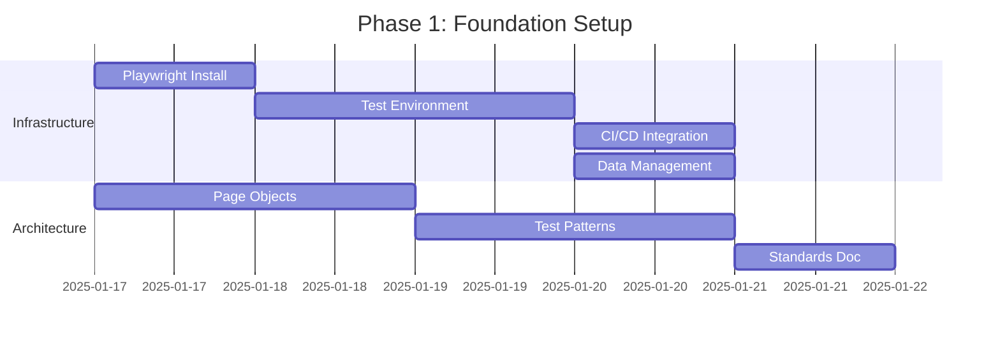

# F8 End-to-End Testing - Agent Orchestration Plan

_Generated: 2025-01-17_ | _Orchestrator: Architecture Consultant_  
_Execution Model: Parallel Multi-Agent with Progressive Validation_

## 🎭 Agent Roster & Specializations

### Primary Agents (Core Implementation)

```yaml
devops_agent:
  specialization: 'Infrastructure, CI/CD, Automation'
  tools: [Bash, Docker, GitHub Actions, Playwright setup]
  responsibilities:
    - Framework installation and configuration
    - Test environment orchestration
    - CI/CD pipeline integration
    - Performance monitoring

qa_agent:
  specialization: 'Test Design, Coverage, Quality Assurance'
  tools: [Playwright, Jest, Test frameworks]
  responsibilities:
    - Test case design and implementation
    - Coverage analysis and reporting
    - Test data management
    - Regression test suite

frontend_agent:
  specialization: 'UI Testing, Visual Regression, Accessibility'
  tools: [Playwright, React Testing, Visual tools]
  responsibilities:
    - Component testing
    - Visual regression testing
    - Cross-browser compatibility
    - Mobile responsiveness

backend_agent:
  specialization: 'API Testing, Service Integration, Data Integrity'
  tools: [Supertest, Contract testing, Database tools]
  responsibilities:
    - API endpoint testing
    - Service boundary validation
    - Database transaction testing
    - Queue message validation
```

### Support Agents (Specialized Tasks)

```yaml
security_agent:
  specialization: 'Security Testing, Compliance, Vulnerability Assessment'
  tools: [OWASP tools, Security scanners, Compliance frameworks]
  responsibilities:
    - Authentication/Authorization testing
    - Input validation and sanitization
    - GDPR/PCI DSS compliance
    - Vulnerability scanning

performance_agent:
  specialization: 'Load Testing, Performance Optimization, Monitoring'
  tools: [k6, Artillery, Performance profilers]
  responsibilities:
    - Load and stress testing
    - Performance regression detection
    - Resource usage monitoring
    - Bottleneck identification

architect_agent:
  specialization: 'System Design, Standards, Best Practices'
  tools: [Design tools, Documentation, Architecture patterns]
  responsibilities:
    - Test architecture design
    - Pattern establishment
    - Code review and standards
    - Cross-agent coordination
```

---

## 📅 Execution Timeline & Dependencies

### Phase 1: Foundation (Days 1-5)



**Parallel Execution Matrix**:

```yaml
day_1:
  devops_agent:
    - Install Playwright framework
    - Configure TypeScript support
    - Set up browser drivers

  architect_agent:
    - Design Page Object structure
    - Create base test classes
    - Define testing standards

day_2:
  devops_agent:
    - Create Docker test environment
    - Set up test databases
    - Configure network isolation

  architect_agent:
    - Implement test helpers
    - Create assertion utilities
    - Design service test patterns

day_3_4:
  devops_agent:
    - GitHub Actions workflow
    - Test data seeding system
    - Environment automation

  qa_agent:
    - First authentication test
    - Test data factories
    - Coverage configuration

day_5:
  all_agents:
    - Integration checkpoint
    - Validate foundation
    - Resolve blockers
```

### Phase 2: Core Testing (Days 6-15)

```yaml
parallel_tracks:
  track_1_critical_paths:
    owner: qa_agent
    duration: 10_days
    deliverables:
      - Authentication flow tests
      - Financial workflow tests
      - Invoice generation tests
      - Payment tracking tests
      - Dashboard validation tests

  track_2_ui_testing:
    owner: frontend_agent
    duration: 10_days
    deliverables:
      - Visual regression setup
      - Component testing
      - Responsive design tests
      - Cross-browser tests
      - Accessibility tests

  track_3_security:
    owner: security_agent
    duration: 10_days
    deliverables:
      - JWT security tests
      - Input validation tests
      - XSS/CSRF prevention
      - Permission boundary tests
      - Compliance validation
```

### Phase 3: Service Integration (Days 16-25)

```yaml
service_testing_matrix:
  api_gateway:
    agent: backend_agent
    tests:
      - Route validation
      - Rate limiting
      - Error handling
      - Auth middleware

  financial_service:
    agent: backend_agent
    tests:
      - CRUD operations
      - GoCardless integration
      - Transaction processing
      - Invoice generation

  trading_service:
    agent: backend_agent
    tests:
      - Strategy execution
      - Market data handling
      - Order placement
      - Risk management

  performance_validation:
    agent: performance_agent
    tests:
      - Load testing
      - Stress testing
      - Memory profiling
      - Bottleneck analysis
```

### Phase 4: Integration & Deployment (Days 26-30)

```yaml
final_integration:
  day_26_27:
    - Merge all test suites
    - Full regression run
    - Performance validation
    - Security audit

  day_28:
    - CI/CD finalization
    - Deployment gates
    - Rollback procedures
    - Monitoring setup

  day_29:
    - Documentation completion
    - Team training
    - Runbook creation
    - Knowledge transfer

  day_30:
    - Production deployment
    - Smoke test validation
    - Go-live confirmation
    - Success metrics review
```

---

## 🔄 Inter-Agent Communication Protocol

### Message Format

```typescript
interface AgentMessage {
  from: AgentRole;
  to: AgentRole | AgentRole[];
  type: 'REQUEST' | 'UPDATE' | 'BLOCKER' | 'COMPLETE';
  priority: 'LOW' | 'MEDIUM' | 'HIGH' | 'CRITICAL';
  payload: {
    task: string;
    status: TaskStatus;
    dependencies?: string[];
    blockers?: string[];
    evidence?: Evidence[];
  };
  timestamp: Date;
}
```

### Communication Matrix

```yaml
communication_rules:
  devops_agent:
    broadcasts: ['environment_ready', 'ci_status', 'deployment_gates']
    listens_to: ['test_requirements', 'performance_metrics']

  qa_agent:
    broadcasts: ['coverage_reports', 'test_results', 'regression_status']
    listens_to: ['environment_status', 'data_availability']

  frontend_agent:
    broadcasts: ['visual_regression', 'ui_coverage', 'accessibility_results']
    listens_to: ['api_contracts', 'test_data']

  backend_agent:
    broadcasts: ['api_coverage', 'service_health', 'integration_status']
    listens_to: ['frontend_requirements', 'security_findings']

  security_agent:
    broadcasts: ['vulnerabilities', 'compliance_status', 'security_gates']
    listens_to: ['all'] # Security monitors everything

  performance_agent:
    broadcasts: ['performance_metrics', 'bottlenecks', 'resource_usage']
    listens_to: ['test_execution', 'service_metrics']

  architect_agent:
    broadcasts: ['standards_updates', 'pattern_changes', 'review_results']
    listens_to: ['all'] # Architect oversees everything
```

---

## 🎯 Task Assignment & Validation

### Task Distribution Algorithm

```typescript
class TaskOrchestrator {
  assignTask(task: Task): Assignment {
    // Analyze task requirements
    const complexity = this.calculateComplexity(task);
    const domain = this.identifyDomain(task);
    const dependencies = this.resolveDependencies(task);

    // Select optimal agent
    const agent = this.selectAgent({
      domain,
      complexity,
      availability: this.getAgentAvailability(),
      expertise: this.getAgentExpertise(domain),
    });

    // Create assignment with validation
    return {
      agent,
      task,
      deadline: this.calculateDeadline(complexity),
      validation: this.createValidationCriteria(task),
      rollback: this.defineRollbackStrategy(task),
    };
  }
}
```

### Progressive Validation Gates

```yaml
validation_gates:
  gate_1_syntax:
    agents: [all]
    criteria:
      - TypeScript: 0 errors
      - ESLint: 0 warnings
      - Prettier: formatted

  gate_2_unit:
    agents: [qa, frontend, backend]
    criteria:
      - Unit tests: passing
      - Coverage: >60
      - Mocks: validated

  gate_3_integration:
    agents: [backend, qa]
    criteria:
      - API tests: passing
      - Service tests: passing
      - Database: consistent

  gate_4_e2e:
    agents: [qa, frontend]
    criteria:
      - User journeys: passing
      - Visual regression: clean
      - Cross-browser: compatible

  gate_5_security:
    agents: [security]
    criteria:
      - Vulnerabilities: 0 critical
      - Compliance: passed
      - Penetration: defended

  gate_6_performance:
    agents: [performance]
    criteria:
      - Response time: <500ms P95
      - Load handling: verified
      - Resource usage: optimal

  gate_7_deployment:
    agents: [devops]
    criteria:
      - Build: successful
      - Tests: all passing
      - Rollback: ready
```

---

## 📊 Success Metrics Per Agent

### Individual Agent KPIs

```yaml
devops_agent_kpis:
  - metric: 'Environment setup time'
    target: '<30 seconds'
  - metric: 'CI pipeline execution'
    target: '<10 minutes'
  - metric: 'Deployment success rate'
    target: '>99%'

qa_agent_kpis:
  - metric: 'Test coverage'
    target: '>80%'
  - metric: 'Test execution time'
    target: '<10 minutes'
  - metric: 'Flakiness rate'
    target: '<2%'

frontend_agent_kpis:
  - metric: 'UI test coverage'
    target: '100% critical paths'
  - metric: 'Visual regression'
    target: '0 unintended changes'
  - metric: 'Accessibility score'
    target: 'WCAG 2.1 AA'

backend_agent_kpis:
  - metric: 'API coverage'
    target: '100% endpoints'
  - metric: 'Service contracts'
    target: '100% validated'
  - metric: 'Integration tests'
    target: '>90% passing'

security_agent_kpis:
  - metric: 'Security vulnerabilities'
    target: '0 critical, 0 high'
  - metric: 'Compliance validation'
    target: '100% GDPR/PCI DSS'
  - metric: 'Auth coverage'
    target: '100% scenarios'

performance_agent_kpis:
  - metric: 'Load test coverage'
    target: 'All critical paths'
  - metric: 'Performance regression'
    target: '<5% degradation'
  - metric: 'Resource efficiency'
    target: '<80% utilization'
```

---

## 🚨 Blocker Resolution Protocol

### Escalation Matrix

```yaml
blocker_severity:
  critical:
    description: 'Blocks all progress'
    escalation_time: 'Immediate'
    resolver: 'architect_agent'
    backup: 'human_intervention'

  high:
    description: 'Blocks agent progress'
    escalation_time: '2 hours'
    resolver: 'lead_agent'
    backup: 'architect_agent'

  medium:
    description: 'Impacts timeline'
    escalation_time: '4 hours'
    resolver: 'peer_agent'
    backup: 'lead_agent'

  low:
    description: 'Minor impediment'
    escalation_time: '8 hours'
    resolver: 'self_resolution'
    backup: 'peer_agent'
```

### Resolution Strategies

```typescript
class BlockerResolver {
  async resolve(blocker: Blocker): Promise<Resolution> {
    // Categorize blocker
    const severity = this.assessSeverity(blocker);
    const type = this.identifyType(blocker);

    // Apply resolution strategy
    switch (type) {
      case 'TECHNICAL':
        return this.technicalResolution(blocker);
      case 'DEPENDENCY':
        return this.dependencyResolution(blocker);
      case 'RESOURCE':
        return this.resourceResolution(blocker);
      case 'KNOWLEDGE':
        return this.knowledgeResolution(blocker);
      default:
        return this.escalate(blocker);
    }
  }
}
```

---

## 🔄 Daily Sync Protocol

### Stand-up Format

```yaml
daily_sync:
  time: '09:00 UTC'
  duration: '15 minutes'
  format:
    - Yesterday's progress
    - Today's plan
    - Blockers
    - Dependencies

  outputs:
    - Progress dashboard update
    - Blocker board update
    - Risk register update
    - Timeline adjustment
```

### Progress Tracking

```typescript
interface DailyProgress {
  date: Date;
  agent: AgentRole;
  completed: Task[];
  inProgress: Task[];
  blocked: Task[];
  metrics: {
    testsWritten: number;
    coverage: number;
    bugsFound: number;
    performance: PerformanceMetrics;
  };
  nextSteps: Task[];
  risks: Risk[];
}
```

---

## 📋 Deliverable Checklist

### Per-Agent Deliverables

```yaml
devops_deliverables:
  week_1:
    - [ ] Playwright installed and configured
    - [ ] Test environment operational
    - [ ] CI/CD pipeline integrated
    - [ ] Test data management system

  week_2_3:
    - [ ] Parallel test execution
    - [ ] Environment automation
    - [ ] Deployment gates configured

  week_4:
    - [ ] Performance monitoring
    - [ ] Rollback procedures
    - [ ] Production ready

qa_deliverables:
  week_1:
    - [ ] First 5 E2E tests
    - [ ] Test data factories
    - [ ] Coverage reporting

  week_2_3:
    - [ ] 25+ critical path tests
    - [ ] Regression suite
    - [ ] Test documentation

  week_4:
    - [ ] 80% coverage achieved
    - [ ] All tests stable
    - [ ] Training materials

frontend_deliverables:
  week_1:
    - [ ] Visual regression setup
    - [ ] Component test framework

  week_2_3:
    - [ ] All UI journeys tested
    - [ ] Cross-browser validation
    - [ ] Accessibility compliance

  week_4:
    - [ ] Mobile testing complete
    - [ ] Performance validated
    - [ ] Documentation complete
```

---

## 🎯 Immediate Action Items

### Hour 0-2: Emergency Bootstrap

```bash
# DevOps Agent: Install Playwright
npm install -D @playwright/test @playwright/test-ct
npx playwright install

# QA Agent: Create first test
mkdir -p tests/e2e/critical
echo "import { test } from '@playwright/test';" > tests/e2e/critical/auth.spec.ts

# Architect Agent: Create structure
mkdir -p tests/{e2e,integration,unit}/{fixtures,helpers,pages}
```

### Hour 2-4: Foundation Setup

```typescript
// Architect Agent: Base configuration
// playwright.config.ts
import { defineConfig } from '@playwright/test';

export default defineConfig({
  testDir: './tests/e2e',
  timeout: 30000,
  retries: 2,
  workers: 4,
  reporter: [['html'], ['junit', { outputFile: 'test-results.xml' }]],
  use: {
    baseURL: process.env.BASE_URL || 'http://localhost:3000',
    screenshot: 'only-on-failure',
    video: 'retain-on-failure',
    trace: 'on-first-retry',
  },
});
```

### Hour 4-6: First Integration

```yaml
# DevOps Agent: GitHub Actions
# .github/workflows/e2e.yml
name: E2E Tests
on: [push, pull_request]
jobs:
  test:
    runs-on: ubuntu-latest
    steps:
      - uses: actions/checkout@v3
      - uses: actions/setup-node@v3
      - run: npm ci
      - run: npx playwright install --with-deps
      - run: npx playwright test
      - uses: actions/upload-artifact@v3
        if: always()
        with:
          name: playwright-report
          path: playwright-report/
```

---

## 🔴 CRITICAL SUCCESS FACTORS

1. **No Compromise on Quality Gates**: Every gate must pass
2. **Parallel Execution**: Agents work simultaneously, not sequentially
3. **Daily Validation**: Progress verified every 24 hours
4. **Immediate Blocker Resolution**: No blocker survives >4 hours
5. **Evidence-Based Progress**: All claims backed by metrics

---

## 📡 Command & Control

**Orchestrator**: Architecture Consultant  
**Escalation**: Immediate to human for CRITICAL blockers  
**Communication**: Async via task system, sync for blockers  
**Validation**: Continuous with hourly checkpoints  
**Rollback**: Always ready, tested daily

---

_This orchestration plan represents the coordinated effort required to achieve 80% test coverage in 30 days. Execution begins IMMEDIATELY._
