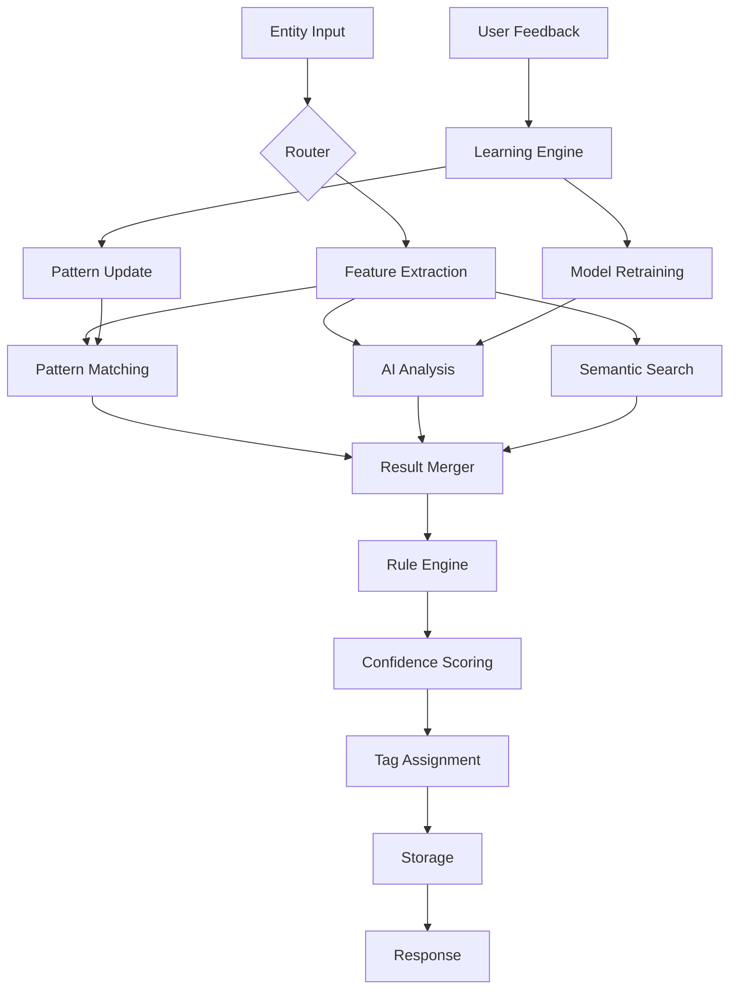

# Universal AI Tagging System - Architecture Design

## Executive Summary

This document outlines the detailed architectural design for the Universal AI Tagging System, a next-generation classification engine that replaces entity-specific categorization with a unified, AI-powered tagging framework.

## System Components

### 1. Core Architecture Layers

```
┌─────────────────────────────────────────────────────────────────┐
│                         API Gateway Layer                         │
│  ┌──────────────┐ ┌──────────────┐ ┌─────────────────────────┐ │
│  │  REST API    │ │  GraphQL API │ │  WebSocket (Real-time)   │ │
│  └──────────────┘ └──────────────┘ └─────────────────────────┘ │
├─────────────────────────────────────────────────────────────────┤
│                      Service Orchestration                        │
│  ┌──────────────────────────────────────────────────────────┐  │
│  │            Universal Tagging Service Manager              │  │
│  │  • Request routing  • Load balancing  • Circuit breaker  │  │
│  └──────────────────────────────────────────────────────────┘  │
├─────────────────────────────────────────────────────────────────┤
│                        Core Services                              │
│  ┌────────────┐ ┌────────────┐ ┌────────────┐ ┌────────────┐  │
│  │  Tagging   │ │   Pattern  │ │    AI      │ │  Learning  │  │
│  │  Engine    │ │   Engine   │ │ Integration│ │   Engine   │  │
│  └────────────┘ └────────────┘ └────────────┘ └────────────┘  │
├─────────────────────────────────────────────────────────────────┤
│                      Infrastructure Layer                         │
│  ┌────────────┐ ┌────────────┐ ┌────────────┐ ┌────────────┐  │
│  │ PostgreSQL │ │   Redis    │ │  Queue     │ │  Vector    │  │
│  │  (Primary) │ │  (Cache)   │ │  (Bull)    │ │  Store     │  │
│  └────────────┘ └────────────┘ └────────────┘ └────────────┘  │
└─────────────────────────────────────────────────────────────────┘
```

### 2. Service Component Details

#### A. Tagging Engine
```typescript
class TaggingEngine {
  // Core tagging logic
  async processEntity(entity: TaggableEntity): Promise<TaggingResult> {
    // 1. Extract features
    const features = await this.featureExtractor.extract(entity);
    
    // 2. Run parallel analysis
    const [patternResults, aiResults, semanticResults] = await Promise.all([
      this.patternEngine.match(features),
      this.aiEngine.analyze(features),
      this.semanticEngine.search(features)
    ]);
    
    // 3. Merge and rank results
    const mergedTags = this.mergeTags(patternResults, aiResults, semanticResults);
    
    // 4. Apply business rules
    const finalTags = await this.ruleEngine.apply(mergedTags, entity);
    
    // 5. Store and return
    return this.persistTags(entity, finalTags);
  }
}
```

#### B. Pattern Engine
```typescript
interface PatternEngine {
  // Pattern types
  patterns: {
    keyword: KeywordMatcher;
    regex: RegexMatcher;
    numeric: NumericRangeMatcher;
    date: DatePatternMatcher;
    composite: CompositeMatcher;
  };
  
  // Matching logic
  async match(features: EntityFeatures): Promise<PatternMatch[]> {
    const matches = await Promise.all(
      Object.values(this.patterns).map(p => p.match(features))
    );
    return this.rankMatches(matches.flat());
  }
}
```

#### C. AI Integration Layer
```typescript
class AIIntegrationService {
  providers: {
    claude: ClaudeProvider;
    openai: OpenAIProvider;
    custom: CustomModelProvider;
  };
  
  async analyze(entity: TaggableEntity): Promise<AIAnalysis> {
    // Select best provider based on entity type
    const provider = this.selectProvider(entity.type);
    
    // Generate prompt
    const prompt = this.promptGenerator.generate(entity);
    
    // Get AI analysis
    const response = await provider.complete(prompt);
    
    // Parse and validate
    return this.parseAIResponse(response);
  }
}
```

#### D. Learning Engine
```typescript
class LearningEngine {
  async processFeedback(feedback: UserFeedback): Promise<void> {
    // Update pattern confidence
    await this.updatePatternConfidence(feedback);
    
    // Retrain if needed
    if (this.shouldRetrain(feedback)) {
      await this.queueRetraining(feedback.entityType);
    }
    
    // Update embeddings
    await this.updateEmbeddings(feedback);
  }
  
  async retrain(entityType: string): Promise<void> {
    // Get training data
    const data = await this.getTrainingData(entityType);
    
    // Train new patterns
    const newPatterns = await this.trainPatterns(data);
    
    // Validate and deploy
    if (await this.validatePatterns(newPatterns)) {
      await this.deployPatterns(newPatterns);
    }
  }
}
```

### 3. Data Flow Architecture



### 4. Caching Architecture

```yaml
Redis Cache Structure:
  tags:
    hierarchy: "tags:hierarchy"              # Full tag tree (24h TTL)
    entity: "tags:entity:{type}:{id}"       # Entity tags (1h TTL)
    pattern: "tags:pattern:{id}"            # Pattern cache (6h TTL)
    
  embeddings:
    tag: "embed:tag:{id}"                   # Tag embeddings (7d TTL)
    entity: "embed:entity:{type}:{id}"      # Entity embeddings (1h TTL)
    
  analytics:
    metrics: "metrics:tag:{id}:{period}"    # Tag metrics (1h TTL)
    accuracy: "metrics:accuracy:{date}"     # Daily accuracy (24h TTL)
```

### 5. Queue Architecture

```typescript
// Queue definitions
const queues = {
  tagging: {
    name: 'tagging-queue',
    jobs: ['tag-entity', 'batch-tag', 'retag'],
    concurrency: 10
  },
  
  learning: {
    name: 'learning-queue',
    jobs: ['process-feedback', 'retrain-patterns', 'update-embeddings'],
    concurrency: 5
  },
  
  analytics: {
    name: 'analytics-queue',
    jobs: ['calculate-metrics', 'generate-reports', 'cleanup-old-data'],
    concurrency: 3
  }
};

// Job processors
class TaggingQueueProcessor {
  @Process('tag-entity')
  async tagEntity(job: Job<TagEntityJob>) {
    const { entityType, entityId, options } = job.data;
    
    try {
      const entity = await this.loadEntity(entityType, entityId);
      const result = await this.taggingEngine.processEntity(entity, options);
      
      await this.notifyCompletion(entityType, entityId, result);
      return result;
    } catch (error) {
      await this.handleError(error, job);
      throw error;
    }
  }
}
```

## Integration Patterns

### 1. Entity Integration

Each entity type requires an adapter to work with the universal tagging system:

```typescript
// Transaction Adapter
class TransactionTagAdapter implements IEntityAdapter {
  async prepareEntity(transaction: Transaction): Promise<TaggableEntity> {
    return {
      type: 'transaction',
      id: transaction.id,
      content: this.extractContent(transaction),
      metadata: {
        amount: transaction.amount,
        currency: transaction.currency,
        date: transaction.date,
        counterparty: transaction.counterparty_name
      }
    };
  }
  
  private extractContent(transaction: Transaction): string {
    return [
      transaction.description,
      transaction.counterparty_name,
      transaction.reference
    ].filter(Boolean).join(' ');
  }
}

// Document Adapter
class DocumentTagAdapter implements IEntityAdapter {
  async prepareEntity(document: Document): Promise<TaggableEntity> {
    return {
      type: 'document',
      id: document.id,
      content: document.content.text,
      metadata: {
        title: document.title,
        format: document.format,
        source: document.metadata.source,
        language: document.content.language
      }
    };
  }
}
```

### 2. AI Provider Integration

```typescript
// Claude Integration
class ClaudeTagProvider implements IAIProvider {
  async generateTags(content: string, context: TagContext): Promise<AITags> {
    const response = await this.claude.complete({
      model: 'claude-3-opus',
      system: this.getSystemPrompt(context),
      messages: [{
        role: 'user',
        content: this.formatContent(content, context)
      }],
      tools: [{
        name: 'suggest_tags',
        description: 'Suggest relevant tags for the content',
        parameters: {
          tags: {
            type: 'array',
            items: {
              type: 'object',
              properties: {
                code: { type: 'string' },
                confidence: { type: 'number' },
                reasoning: { type: 'string' }
              }
            }
          }
        }
      }]
    });
    
    return this.parseResponse(response);
  }
}

// OpenAI Integration
class OpenAITagProvider implements IAIProvider {
  async generateEmbedding(content: string): Promise<number[]> {
    const response = await this.openai.embeddings.create({
      model: 'text-embedding-ada-002',
      input: content
    });
    
    return response.data[0].embedding;
  }
}
```

### 3. Cross-Entity Relationship Discovery

```typescript
class RelationshipDiscovery {
  async discoverRelationships(
    entity: TaggableEntity,
    tags: AppliedTag[]
  ): Promise<EntityRelationship[]> {
    const relationships: EntityRelationship[] = [];
    
    // 1. Find entities with similar tags
    const similarEntities = await this.findSimilarByTags(tags);
    
    // 2. Semantic search for mentions
    const mentionedEntities = await this.searchMentions(entity.content);
    
    // 3. Temporal correlation
    const temporalRelated = await this.findTemporalCorrelations(entity);
    
    // 4. Pattern-based relationships
    const patternRelated = await this.findPatternRelationships(entity);
    
    // 5. Merge and score relationships
    return this.mergeRelationships([
      ...similarEntities,
      ...mentionedEntities,
      ...temporalRelated,
      ...patternRelated
    ]);
  }
}
```

## Performance Optimization

### 1. Database Optimization

```sql
-- Optimized indexes for common queries
CREATE INDEX idx_entity_tags_lookup 
  ON entity_tags(entity_type, entity_id, tag_id) 
  WHERE is_verified = true;

CREATE INDEX idx_tag_search 
  ON universal_tags USING gin(to_tsvector('english', name || ' ' || description));

CREATE INDEX idx_embedding_search 
  ON universal_tags USING ivfflat(embedding vector_cosine_ops)
  WITH (lists = 100);

-- Materialized view for tag statistics
CREATE MATERIALIZED VIEW tag_statistics AS
SELECT 
  t.id,
  t.code,
  COUNT(DISTINCT et.entity_id) as usage_count,
  AVG(et.confidence) as avg_confidence,
  COUNT(CASE WHEN et.is_verified THEN 1 END)::float / 
    NULLIF(COUNT(*), 0) as verification_rate
FROM universal_tags t
LEFT JOIN entity_tags et ON t.id = et.tag_id
GROUP BY t.id, t.code;

CREATE INDEX idx_tag_stats_usage ON tag_statistics(usage_count DESC);
```

### 2. Caching Strategy

```typescript
class TagCacheManager {
  private readonly layers = {
    l1: new MemoryCache({ maxSize: 1000 }),     // In-memory
    l2: new RedisCache({ ttl: 3600 }),          // Redis
    l3: new DatabaseCache()                      // PostgreSQL
  };
  
  async get(key: string): Promise<any> {
    // Try each layer
    for (const layer of Object.values(this.layers)) {
      const value = await layer.get(key);
      if (value) {
        // Promote to higher layers
        await this.promote(key, value);
        return value;
      }
    }
    return null;
  }
  
  async set(key: string, value: any, options?: CacheOptions): Promise<void> {
    // Write to all applicable layers
    await Promise.all(
      Object.values(this.layers).map(layer => 
        layer.set(key, value, options)
      )
    );
  }
}
```

### 3. Batch Processing Optimization

```typescript
class BatchProcessor {
  async processBatch(entities: TaggableEntity[]): Promise<BatchResult> {
    // Group by entity type for optimized processing
    const grouped = this.groupByType(entities);
    
    // Process each group in parallel
    const results = await Promise.all(
      Object.entries(grouped).map(async ([type, group]) => {
        // Load type-specific patterns once
        const patterns = await this.loadPatterns(type);
        
        // Process entities in chunks
        const chunks = this.chunk(group, 50);
        const chunkResults = await this.processChunks(chunks, patterns);
        
        return { type, results: chunkResults };
      })
    );
    
    return this.mergeResults(results);
  }
}
```

## Monitoring and Observability

### 1. Metrics Collection

```typescript
// Prometheus metrics
const metrics = {
  tagging_operations_total: new Counter({
    name: 'tagging_operations_total',
    help: 'Total tagging operations',
    labelNames: ['entity_type', 'method', 'status']
  }),
  
  tagging_duration_seconds: new Histogram({
    name: 'tagging_duration_seconds',
    help: 'Tagging operation duration',
    labelNames: ['entity_type', 'method'],
    buckets: [0.1, 0.5, 1, 2, 5, 10]
  }),
  
  tag_confidence_score: new Histogram({
    name: 'tag_confidence_score',
    help: 'Distribution of tag confidence scores',
    labelNames: ['entity_type', 'tag_code'],
    buckets: [0.1, 0.2, 0.3, 0.4, 0.5, 0.6, 0.7, 0.8, 0.9, 1.0]
  }),
  
  ai_provider_latency: new Histogram({
    name: 'ai_provider_latency_seconds',
    help: 'AI provider response latency',
    labelNames: ['provider', 'operation'],
    buckets: [0.5, 1, 2, 5, 10, 30]
  })
};
```

### 2. Logging Strategy

```typescript
// Structured logging
const logger = winston.createLogger({
  format: winston.format.combine(
    winston.format.timestamp(),
    winston.format.errors({ stack: true }),
    winston.format.json()
  ),
  defaultMeta: { service: 'universal-tagging' },
  transports: [
    new winston.transports.Console({
      format: winston.format.simple()
    }),
    new winston.transports.File({
      filename: 'tagging-errors.log',
      level: 'error'
    }),
    new winston.transports.File({
      filename: 'tagging-audit.log',
      level: 'info'
    })
  ]
});

// Audit logging
class TaggingAuditLogger {
  async logTagOperation(operation: TagOperation): Promise<void> {
    await logger.info('Tag operation', {
      type: 'TAG_OPERATION',
      entityType: operation.entityType,
      entityId: operation.entityId,
      tags: operation.tags,
      method: operation.method,
      userId: operation.userId,
      timestamp: new Date().toISOString()
    });
  }
}
```

### 3. Health Checks

```typescript
class HealthCheckService {
  async checkHealth(): Promise<HealthStatus> {
    const checks = await Promise.allSettled([
      this.checkDatabase(),
      this.checkRedis(),
      this.checkAIProviders(),
      this.checkQueues()
    ]);
    
    return {
      status: checks.every(c => c.status === 'fulfilled') ? 'healthy' : 'unhealthy',
      checks: {
        database: this.extractStatus(checks[0]),
        redis: this.extractStatus(checks[1]),
        aiProviders: this.extractStatus(checks[2]),
        queues: this.extractStatus(checks[3])
      },
      timestamp: new Date().toISOString()
    };
  }
}
```

## Security Architecture

### 1. Access Control

```typescript
// Tag-level permissions
interface TagPermissions {
  create: string[];    // Roles that can create tags
  apply: string[];     // Roles that can apply tags
  remove: string[];    // Roles that can remove tags
  verify: string[];    // Roles that can verify tags
  manage: string[];    // Roles that can manage tag definitions
}

// Entity-level permissions
interface EntityTagPermissions {
  canTag(user: User, entity: TaggableEntity): boolean;
  canRemoveTag(user: User, entity: TaggableEntity, tag: UniversalTag): boolean;
  canVerifyTag(user: User, entityTag: EntityTag): boolean;
}
```

### 2. Data Protection

```typescript
class TagDataProtection {
  // Encrypt sensitive tag patterns
  async encryptPattern(pattern: any): Promise<EncryptedPattern> {
    const key = await this.getEncryptionKey();
    const encrypted = await crypto.encrypt(JSON.stringify(pattern), key);
    return {
      data: encrypted,
      keyId: key.id,
      algorithm: 'AES-256-GCM'
    };
  }
  
  // Anonymize entities for analytics
  async anonymizeForAnalytics(entities: TaggableEntity[]): Promise<AnonymizedEntity[]> {
    return entities.map(entity => ({
      type: entity.type,
      tags: entity.tags,
      timestamp: entity.timestamp,
      // Remove identifying information
      id: this.hashId(entity.id),
      content: '[REDACTED]'
    }));
  }
}
```

## Deployment Architecture

### 1. Container Structure

```yaml
version: '3.8'
services:
  tagging-api:
    image: ai-service/tagging-api:latest
    replicas: 3
    environment:
      - NODE_ENV=production
      - DATABASE_URL=${DATABASE_URL}
      - REDIS_URL=${REDIS_URL}
    ports:
      - "3000:3000"
    
  tagging-worker:
    image: ai-service/tagging-worker:latest
    replicas: 2
    environment:
      - WORKER_TYPE=tagging
      - QUEUE_URL=${REDIS_URL}
    
  learning-worker:
    image: ai-service/learning-worker:latest
    replicas: 1
    environment:
      - WORKER_TYPE=learning
      - AI_PROVIDER=${AI_PROVIDER}
```

### 2. Scaling Strategy

```typescript
// Horizontal scaling rules
const scalingRules = {
  api: {
    metric: 'cpu',
    target: 70,
    min: 2,
    max: 10
  },
  
  workers: {
    metric: 'queue_depth',
    target: 100,
    min: 1,
    max: 5
  }
};

// Vertical scaling for specific operations
const resourceAllocation = {
  batchTagging: {
    cpu: '2000m',
    memory: '4Gi'
  },
  
  aiAnalysis: {
    cpu: '1000m',
    memory: '2Gi'
  },
  
  learning: {
    cpu: '4000m',
    memory: '8Gi'
  }
};
```

## Disaster Recovery

### 1. Backup Strategy

```bash
# Daily backup of tag definitions and patterns
0 2 * * * pg_dump -t universal_tags -t tag_patterns > tags_backup_$(date +%Y%m%d).sql

# Continuous backup of entity tags
pg_basebackup -D /backup/continuous -R -X stream

# Redis persistence
save 900 1
save 300 10
save 60 10000
```

### 2. Recovery Procedures

```typescript
class DisasterRecovery {
  async recoverFromBackup(backupDate: Date): Promise<RecoveryResult> {
    // 1. Restore database
    await this.restoreDatabase(backupDate);
    
    // 2. Rebuild caches
    await this.rebuildCaches();
    
    // 3. Reprocess failed operations
    await this.reprocessFailedOperations(backupDate);
    
    // 4. Validate system integrity
    await this.validateSystemIntegrity();
    
    return {
      recoveredTags: await this.countTags(),
      recoveredMappings: await this.countMappings(),
      dataLoss: await this.assessDataLoss(backupDate)
    };
  }
}
```

## Conclusion

This architecture provides a robust, scalable foundation for universal tagging across all entity types. The modular design allows for easy extension, while the performance optimizations ensure the system can handle millions of entities efficiently. The integration of AI providers enables intelligent tagging, while the learning system continuously improves accuracy based on user feedback.