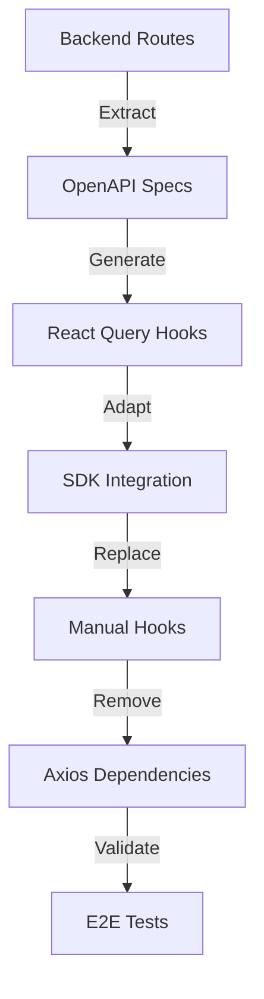

# OpenAPI Orchestration Plan - Complete Implementation

## Executive Summary

This orchestration plan coordinates the parallel execution of multiple specialized agents to complete the OpenAPI specifications and fully implement openapi-react-query-codegen. The goal is to eliminate all manual hooks, remove axios completely, and establish a fully type-safe, auto-generated API client layer.

## Current State Analysis

### What We Have
- ✅ openapi-react-query-codegen installed and configured
- ✅ Generated hooks for GET operations only
- ✅ SDK client infrastructure in place
- ✅ 7 OpenAPI spec files (but incomplete)

### What's Missing
- ❌ POST/PUT/DELETE/PATCH operations in OpenAPI specs
- ❌ Complete hook generation for all operations
- ❌ 13 manual hooks still using axios
- ❌ Comprehensive validation coverage
- ❌ Full SDK integration

## Architecture Overview



## Orchestration Strategy

### Phase 1: Discovery & Analysis (2 hours - PARALLEL)

#### Agent Deployment
```bash
# Deploy 5 agents in parallel for discovery
parallel -j 5 << 'EOF'
/spawn-agent --type crud-specialist --task "Analyze all backend routes in /src/routes/*.ts and document CRUD operations" --output docs/analysis/crud-operations.md
/spawn-agent --type prisma-specialist --task "Map database operations to API endpoints" --output docs/analysis/db-api-mapping.md
/spawn-agent --type ui-specialist --task "Inventory all manual hooks and their usage" --output docs/analysis/manual-hooks-inventory.md
/spawn-agent --type qa-specialist --task "Create test inventory for affected components" --output docs/analysis/test-inventory.md
/spawn-agent --type devops-specialist --task "Analyze build pipeline for openapi generation" --output docs/analysis/pipeline-requirements.md
EOF
```

#### Deliverables
1. **CRUD Operations Matrix** - Complete mapping of all endpoints
2. **Database-API Alignment** - Prisma models to API operations
3. **Manual Hooks Inventory** - All 13 hooks with dependencies
4. **Test Coverage Map** - Components requiring validation
5. **Pipeline Requirements** - CI/CD adjustments needed

### Phase 2: OpenAPI Specification Completion (3 hours - PARALLEL)

#### Agent Tasks

**Team 1: Financial Domain**
```bash
/spawn-agent --type crud-specialist \
  --task "Complete financial.yaml with all CRUD operations from financial.ts" \
  --context @src/routes/financial.ts \
  --output openapi/financial-complete.yaml
```

**Team 2: Trading Domain**
```bash
/spawn-agent --type crud-specialist \
  --task "Complete trading.yaml with all operations from trading routes" \
  --context @src/routes/trading.ts,@src/routes/trade.routes.ts,@src/routes/position.routes.ts \
  --output openapi/trading-complete.yaml
```

**Team 3: Core Services**
```bash
/spawn-agent --type crud-specialist \
  --task "Complete auth.yaml and gateway.yaml specifications" \
  --context @src/routes/auth.ts,@src/routes/gateway.ts \
  --output openapi/core-complete.yaml
```

**Team 4: Support Services**
```bash
/spawn-agent --type crud-specialist \
  --task "Complete ai-core.yaml and comm.yaml specifications" \
  --context @src/routes/ai.ts,@src/routes/comm.ts \
  --output openapi/support-complete.yaml
```

#### OpenAPI Template Structure
```yaml
# Each endpoint must include:
paths:
  /api/resource:
    get:
      operationId: listResources
      parameters: [...]
      responses: [...]
    post:
      operationId: createResource
      requestBody:
        required: true
        content:
          application/json:
            schema:
              $ref: '#/components/schemas/CreateResourceDto'
      responses: [...]
  /api/resource/{id}:
    get:
      operationId: getResource
      parameters: [...]
      responses: [...]
    put:
      operationId: updateResource
      requestBody: [...]
      responses: [...]
    delete:
      operationId: deleteResource
      parameters: [...]
      responses: [...]
```

### Phase 3: Hook Generation & Migration (4 hours - PARALLEL)

#### Step 1: Generate Complete Hooks
```bash
# Configure for all specs
cat > frontend/openapi-rq.config.ts << 'EOF'
import { defineConfig } from '@7nohe/openapi-react-query-codegen';

export default defineConfig([
  {
    input: '../openapi/financial-complete.yaml',
    output: {
      path: './src/generated/financial',
      clean: true,
    },
    client: 'fetch', // Use fetch instead of axios
  },
  {
    input: '../openapi/trading-complete.yaml',
    output: {
      path: './src/generated/trading',
      clean: true,
    },
    client: 'fetch',
  },
  {
    input: '../openapi/auth-complete.yaml',
    output: {
      path: './src/generated/auth',
      clean: true,
    },
    client: 'fetch',
  },
]);
EOF

# Generate hooks
npx openapi-rq -c openapi-rq.config.ts
```

#### Step 2: Create SDK Adapters
```typescript
// src/generated/sdk-adapter.ts
import { sdkClient } from '@ai/sdk-client';
import { OpenAPIConfig } from './hooks/requests/core/OpenAPI';

// Configure OpenAPI client to use SDK
OpenAPIConfig.BASE = '';
OpenAPIConfig.VERSION = '1.0.0';
OpenAPIConfig.WITH_CREDENTIALS = true;
OpenAPIConfig.CREDENTIALS = 'include';
OpenAPIConfig.TOKEN = async () => {
  const token = await sdkClient.auth.getToken();
  return token;
};

// Custom fetch that uses SDK client
OpenAPIConfig.FETCH = async (url, init) => {
  return sdkClient.request(url, init);
};
```

#### Step 3: Migration Matrix

| Manual Hook | Generated Hook | Components Using | Priority |
|------------|---------------|-----------------|----------|
| use-client.ts | useFinancialQueries | ClientList, ClientDetail | HIGH |
| use-invoice-template.ts | useInvoiceTemplateQueries | InvoiceForm | HIGH |
| use-accounts.ts | useAccountQueries | BankAccounts, Dashboard | HIGH |
| use-trade.ts | useTradingQueries | TradingDashboard | MEDIUM |
| use-position.ts | usePositionQueries | Positions | MEDIUM |
| use-notification.ts | useNotificationQueries | NotificationSettings | LOW |
| use-alert.ts | useAlertQueries | AlertList | LOW |
| use-entity-tag.ts | useTagQueries | TagManagement | LOW |
| use-universal-tag.ts | useUniversalTagQueries | TagSelector | LOW |
| use-invoice-attachment.ts | useAttachmentQueries | InvoiceDetail | LOW |
| use-report.ts | useReportQueries | Reports | LOW |

### Phase 4: Parallel Component Migration (3 hours)

#### Migration Teams

**Team Alpha: High Priority Components**
```bash
/spawn-agent --type ui-specialist \
  --task "Migrate ClientList, ClientDetail, ClientForm from manual hooks to generated" \
  --files src/pages/clients/*.tsx \
  --parallel 3
```

**Team Beta: Dashboard Components**
```bash
/spawn-agent --type ui-specialist \
  --task "Migrate Dashboard and BankAccounts to generated hooks" \
  --files src/pages/Dashboard.tsx,src/pages/BankAccounts.tsx \
  --parallel 2
```

**Team Gamma: Trading Components**
```bash
/spawn-agent --type ui-specialist \
  --task "Migrate all trading components to generated hooks" \
  --files src/pages/trading/*.tsx \
  --parallel 4
```

**Team Delta: Support Components**
```bash
/spawn-agent --type ui-specialist \
  --task "Migrate notification, alert, and tag components" \
  --files src/pages/NotificationSettings.tsx,src/pages/alert/*.tsx,src/pages/tags/*.tsx \
  --parallel 3
```

### Phase 5: Axios Removal & Cleanup (1 hour - PARALLEL)

#### Step 1: Remove Axios Dependencies
```bash
# Remove from all files
/spawn-agent --type crud-specialist \
  --task "Remove all axios imports and replace with generated hooks" \
  --files src/**/*.ts,src/**/*.tsx \
  --parallel 10
```

#### Step 2: Update Package.json
```bash
# Remove axios from dependencies
npm uninstall axios
```

#### Step 3: Clean Up Manual Hooks
```bash
# Archive manual hooks (don't delete yet)
mkdir -p src/hooks/deprecated
mv src/hooks/use-*.ts src/hooks/deprecated/
```

### Phase 6: Validation & Testing (2 hours - PARALLEL)

#### Comprehensive Validation
```bash
# Deploy QA agents in parallel
parallel -j 4 << 'EOF'
/spawn-agent --type qa-specialist --task "Run TypeScript compilation checks" --command "npm run typecheck"
/spawn-agent --type qa-specialist --task "Run ESLint on all modified files" --command "npm run lint"
/spawn-agent --type qa-specialist --task "Run unit tests for all components" --command "npm test"
/spawn-agent --type qa-specialist --task "Run E2E tests for critical paths" --command "npm run test:e2e"
EOF
```

#### Validation Checklist
- [ ] All TypeScript errors resolved
- [ ] No ESLint warnings
- [ ] All unit tests passing
- [ ] E2E tests for critical paths passing
- [ ] No axios imports remaining
- [ ] All manual hooks replaced
- [ ] Build succeeds in production mode
- [ ] Bundle size reduced (no axios)

## Risk Mitigation

### Rollback Strategy
1. **Git branches**: Create feature branch for each phase
2. **Backup hooks**: Keep manual hooks in deprecated folder
3. **Incremental migration**: Test each component before moving to next
4. **Feature flags**: Use flags to toggle between manual and generated

### Known Risks
1. **Breaking changes**: Generated hooks may have different signatures
2. **Type mismatches**: OpenAPI types may differ from manual types
3. **Missing operations**: Some endpoints might not be documented
4. **Performance**: Initial load might be slower with all hooks

## Success Metrics

### Quantitative
- **0 axios imports** in frontend codebase
- **100% OpenAPI coverage** for all backend endpoints
- **13/13 manual hooks** replaced with generated
- **0 TypeScript errors** after migration
- **<5% bundle size increase** (fetch vs axios)

### Qualitative
- **Type safety**: Full end-to-end type safety
- **Developer experience**: Auto-completion for all API calls
- **Maintainability**: Single source of truth (OpenAPI specs)
- **Documentation**: Auto-generated API documentation
- **Testing**: Easier to mock with generated hooks

## Timeline

| Phase | Duration | Start | End | Status |
|-------|----------|-------|-----|--------|
| Discovery & Analysis | 2 hours | T+0 | T+2h | 🔄 |
| OpenAPI Completion | 3 hours | T+0 | T+3h | 🔄 |
| Hook Generation | 4 hours | T+3h | T+7h | ⏳ |
| Component Migration | 3 hours | T+3h | T+6h | ⏳ |
| Axios Removal | 1 hour | T+6h | T+7h | ⏳ |
| Validation | 2 hours | T+7h | T+9h | ⏳ |

**Total Duration**: 9 hours (with parallel execution)
**Sequential Duration**: Would be 15 hours without parallelization

## Command Center

### Monitoring Dashboard
```bash
# Create monitoring script
cat > monitor-migration.sh << 'EOF'
#!/bin/bash
while true; do
  clear
  echo "=== OpenAPI Migration Status ==="
  echo "Axios imports: $(grep -r "import.*axios" src/ | wc -l)"
  echo "Manual hooks: $(ls src/hooks/use-*.ts 2>/dev/null | wc -l)"
  echo "Generated hooks: $(find src/generated -name "*.ts" | wc -l)"
  echo "TypeScript errors: $(npm run typecheck 2>&1 | grep error | wc -l)"
  echo "Tests passing: $(npm test -- --reporter=json | jq '.numPassedTests')"
  sleep 5
done
EOF
chmod +x monitor-migration.sh
```

### Emergency Commands
```bash
# Rollback to manual hooks
git checkout HEAD -- src/hooks/
git checkout HEAD -- src/pages/
git checkout HEAD -- src/components/

# Restore axios
npm install axios@^1.10.0

# Clear generated files
rm -rf src/generated/

# Reset OpenAPI specs
git checkout HEAD -- openapi/
```

## Post-Migration Tasks

1. **Documentation Update**
   - Update README with new API client usage
   - Create migration guide for other developers
   - Document breaking changes

2. **Performance Optimization**
   - Implement query caching strategies
   - Add prefetching for common routes
   - Optimize bundle splitting

3. **Developer Training**
   - Create examples of generated hook usage
   - Document custom hook patterns
   - Share best practices

## Conclusion

This orchestration plan leverages parallel execution to complete a complex migration in 9 hours instead of 15+ hours sequential. The key to success is:

1. **Parallel discovery** to understand the full scope
2. **Parallel specification** completion by domain
3. **Parallel migration** of components by priority
4. **Comprehensive validation** at each phase
5. **Clear rollback strategy** if issues arise

The end result will be a fully type-safe, auto-generated API client layer with zero manual maintenance overhead.