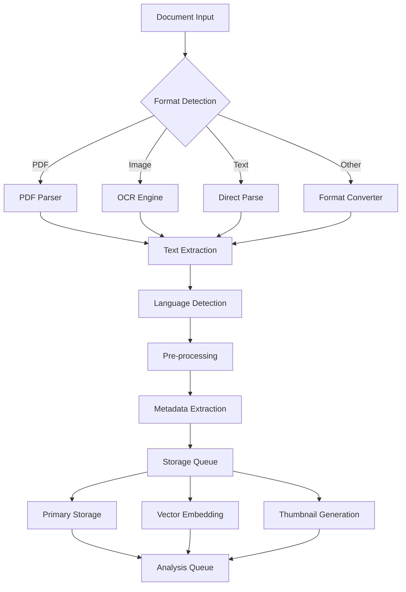
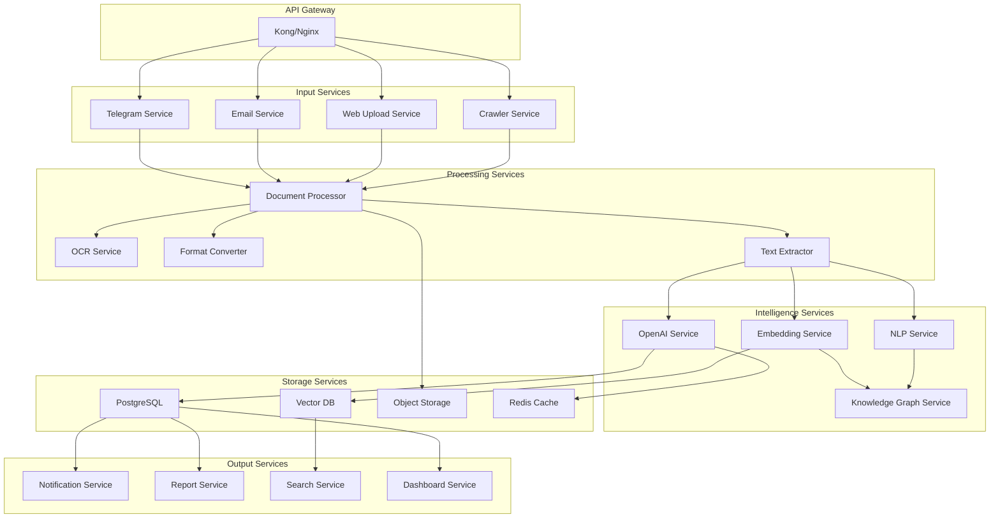
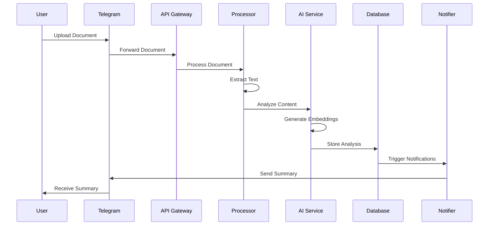
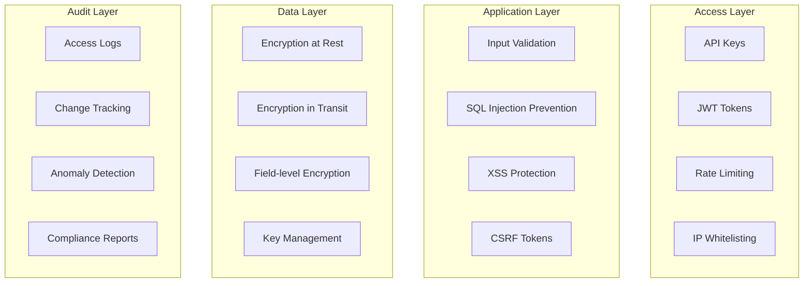

# 🧠 Document Intelligence System - Scope Definition v2

## 📋 Tabla de Contenidos

1. [Resumen Ejecutivo](#resumen-ejecutivo)
2. [Visión y Objetivos](#visión-y-objetivos)
3. [Alcance Funcional](#alcance-funcional)
4. [Arquitectura Técnica](#arquitectura-técnica)
5. [Implementación por Fases](#implementación-por-fases)
6. [Stack Tecnológico](#stack-tecnológico)
7. [Modelos de Datos](#modelos-de-datos)
8. [Seguridad y Privacidad](#seguridad-y-privacidad)
9. [Métricas de Éxito](#métricas-de-éxito)
10. [Roadmap](#roadmap)

---

## 🎯 Resumen Ejecutivo

### Visión Original (v1)
*"Crear un sistema centralizado para almacenar, analizar y enriquecer documentos, permitiendo consultas conversacionales y aprendizaje continuo"*

### Visión Ampliada (v2)
Transformar AI Service en una **extensión ultra-poderosa del cerebro humano** mediante un sistema de Document Intelligence que no solo almacena y analiza documentos, sino que:

- **Amplifica capacidades cognitivas** mediante IA avanzada
- **Genera insights proactivos** sin necesidad de consultar
- **Aprende continuamente** de las interacciones
- **Se integra naturalmente** en el flujo de trabajo diario
- **Escala hacia monetización** como servicio B2B

---

## 📊 Visión y Objetivos

### Objetivo Principal
Crear un **segundo cerebro digital** que procese, comprenda y conecte información de manera superior a la capacidad humana, proporcionando:

1. **Memoria perfecta**: Nunca olvidar ningún detalle importante
2. **Comprensión profunda**: Análisis que va más allá de la lectura superficial
3. **Conexiones ocultas**: Descubrir relaciones no evidentes entre documentos
4. **Proactividad inteligente**: Alertar sobre información crítica automáticamente
5. **Aprendizaje continuo**: Mejorar con cada interacción

### Objetivos Específicos

#### Corto Plazo (MVP - 2 semanas)
- ✅ Ingesta básica de documentos (PDF, TXT, MD)
- ✅ Análisis con OpenAI GPT-4
- ✅ Búsqueda semántica funcional
- ✅ Interface Telegram operativa
- ✅ Dashboard web básico

#### Mediano Plazo (v1.0 - 1 mes)
- ✅ Multi-formato completo (Office, imágenes, HTML)
- ✅ Knowledge Graph funcional
- ✅ Aprendizaje por feedback
- ✅ Investigación online integrada
- ✅ Notificaciones proactivas

#### Largo Plazo (v2.0 - 3 meses)
- ✅ Multi-usuario con permisos
- ✅ API comercializable
- ✅ Modelos on-premise opcionales
- ✅ Compliance empresarial
- ✅ White-label disponible

---

## 🔧 Alcance Funcional

### 1. Ingesta de Documentos (Ampliado)

#### 1.1 Canales de Entrada

**Telegram Bot** (Prioridad Alta)
```
/upload - Subir documento
/url [link] - Analizar página web
/voice - Transcribir audio a documento
/forward - Analizar mensaje reenviado
/batch - Subir múltiples archivos
```

**Email Gateway** (Prioridad Media)
- Email dedicado: `docs@ai-service.local`
- Auto-procesamiento de attachments
- Parsing de contenido HTML/texto
- Respuesta automática con resumen

**Web Dashboard** (Prioridad Alta)
- Drag & drop múltiple
- Upload por carpetas
- Import desde URL
- Conectores cloud (Google Drive, Dropbox)

**API REST** (Prioridad Media)
```typescript
POST /api/documents/upload
POST /api/documents/analyze
POST /api/documents/batch
GET  /api/documents/status/{id}
```

**Crawler/Monitor** (Prioridad Baja)
- Sitios web configurados
- RSS feeds
- Cambios en páginas específicas
- APIs de terceros

#### 1.2 Formatos Soportados

**Fase 1 - Core**
| Formato | Método | Prioridad |
|---------|---------|-----------|
| PDF | pdf-parse + OCR fallback | Alta |
| TXT/MD | Direct parsing | Alta |
| Images | Tesseract.js OCR | Alta |
| HTML | Cheerio + Readability | Media |

**Fase 2 - Extended**
| Formato | Método | Prioridad |
|---------|---------|-----------|
| DOCX | mammoth.js | Media |
| XLSX | xlsx parser | Media |
| Audio | Whisper API | Baja |
| Video | Frame extraction + OCR | Baja |
| Email | mailparser | Media |

#### 1.3 Pipeline de Procesamiento



### 2. Procesamiento y Análisis (Mejorado)

#### 2.1 Análisis Multi-nivel

**Nivel 1: Extracción Básica**
```typescript
interface BasicAnalysis {
  title: string;
  author?: string;
  date?: Date;
  language: string;
  wordCount: number;
  pageCount?: number;
  summary: string; // 2-3 sentences
}
```

**Nivel 2: Análisis Profundo**
```typescript
interface DeepAnalysis {
  entities: {
    people: Entity[];
    organizations: Entity[];
    locations: Entity[];
    dates: DateReference[];
    amounts: MoneyAmount[];
    percentages: Percentage[];
  };
  keyPhrases: string[];
  topics: Topic[];
  sentiment: SentimentAnalysis;
  actionItems: ActionItem[];
  questions: Question[]; // Questions the document answers
}
```

**Nivel 3: Análisis Contextual**
```typescript
interface ContextualAnalysis {
  relatedDocuments: DocumentReference[];
  contradictions: Contradiction[];
  updates: Update[]; // What this updates from previous docs
  dependencies: Dependency[];
  timeline: TimelineEvent[];
  knowledgeGraph: GraphUpdate;
}
```

#### 2.2 Perfiles de Análisis Personalizados

```typescript
// Ejemplo: Perfil Legal
const legalProfile: AnalysisProfile = {
  name: "Legal Document Analysis",
  focus: ["obligations", "deadlines", "parties", "clauses"],
  extractors: [
    new ClauseExtractor(),
    new DeadlineExtractor(),
    new PartyExtractor(),
    new ObligationExtractor()
  ],
  alerts: [
    { trigger: "deadline < 30 days", priority: "high" },
    { trigger: "penalty clause", priority: "medium" }
  ],
  outputFormat: "legal-summary"
};

// Ejemplo: Perfil Financiero
const financialProfile: AnalysisProfile = {
  name: "Financial Analysis",
  focus: ["amounts", "transactions", "ratios", "trends"],
  extractors: [
    new TransactionExtractor(),
    new FinancialRatioExtractor(),
    new TrendAnalyzer()
  ],
  alerts: [
    { trigger: "unusual transaction", priority: "high" },
    { trigger: "ratio out of range", priority: "medium" }
  ],
  outputFormat: "financial-report"
};
```

### 3. Knowledge Management (Nuevo)

#### 3.1 Knowledge Graph

```typescript
interface KnowledgeGraph {
  nodes: Map<string, KnowledgeNode>;
  edges: Map<string, KnowledgeEdge>;
  clusters: Cluster[];
  
  // Operations
  addDocument(doc: Document): GraphUpdate;
  findConnections(nodeId: string, depth: number): Connection[];
  detectCommunities(): Community[];
  suggestMissingLinks(): LinkSuggestion[];
}

interface KnowledgeNode {
  id: string;
  type: "entity" | "concept" | "document" | "event";
  label: string;
  properties: Record<string, any>;
  embedding: number[]; // Vector representation
  importance: number; // PageRank score
  documents: Set<string>; // Document references
}
```

#### 3.2 Semantic Search Engine

```typescript
interface SearchEngine {
  // Different search modes
  searchByText(query: string, filters?: Filter[]): SearchResult[];
  searchBySimilarity(documentId: string, threshold: number): SearchResult[];
  searchByExample(example: string): SearchResult[];
  searchByQuestion(question: string): AnswerResult;
  
  // Advanced features
  explainRelevance(resultId: string): Explanation;
  refineSearch(feedback: SearchFeedback): SearchResult[];
  suggestFilters(currentResults: SearchResult[]): Filter[];
}
```

### 4. Aprendizaje Continuo (Mejorado)

#### 4.1 Feedback Loop

```typescript
interface LearningSystem {
  // Explicit feedback
  correctClassification(docId: string, correct: string): void;
  markRelevant(searchId: string, docId: string): void;
  markIrrelevant(searchId: string, docId: string): void;
  
  // Implicit feedback
  trackClickthrough(resultId: string): void;
  trackDwellTime(docId: string, seconds: number): void;
  trackQuery(query: string, selectedResults: string[]): void;
  
  // Model updates
  retrain(): Promise<ModelVersion>;
  evaluate(): ModelMetrics;
  rollback(version: string): void;
}
```

#### 4.2 Active Learning

```typescript
interface ActiveLearning {
  // Identify uncertain classifications
  getUncertainDocuments(): UncertainDocument[];
  
  // Request human input
  requestLabeling(doc: Document): LabelingTask;
  
  // Improve from corrections
  learn(task: CompletedTask): void;
  
  // Measure improvement
  getImprovementMetrics(): Metrics;
}
```

### 5. Comunicación Proactiva (Nuevo)

#### 5.1 Sistema de Alertas Inteligentes

```typescript
interface AlertSystem {
  rules: AlertRule[];
  
  // Rule types
  deadlineAlert(days: number): AlertRule;
  keywordAlert(keywords: string[]): AlertRule;
  entityMentionAlert(entities: string[]): AlertRule;
  anomalyAlert(threshold: number): AlertRule;
  
  // Delivery
  sendAlert(alert: Alert, channel: Channel): void;
  scheduleDigest(frequency: Frequency): void;
  personalizeDelivery(user: User): DeliveryPreferences;
}
```

#### 5.2 Informes Automáticos

```typescript
interface ReportGenerator {
  // Report types
  dailyDigest(user: User): Report;
  weeklyAnalysis(topics: string[]): Report;
  monthlyTrends(): Report;
  customReport(config: ReportConfig): Report;
  
  // Formats
  generatePDF(report: Report): Buffer;
  generateHTML(report: Report): string;
  generateMarkdown(report: Report): string;
  generateDashboard(report: Report): DashboardConfig;
}
```

---

## 🏗️ Arquitectura Técnica

### Arquitectura de Microservicios



### Flujo de Datos



---

## 💻 Stack Tecnológico

### Core Platform
- **Runtime**: Node.js 20 LTS + TypeScript 5.x
- **Framework**: Express.js con arquitectura modular
- **Queue**: BullMQ con Redis
- **Scheduler**: node-cron + Agenda

### AI/ML Stack
- **LLM**: OpenAI GPT-4o-mini (costo-eficiente)
- **Embeddings**: OpenAI text-embedding-3-small
- **OCR**: Tesseract.js + fallback a Cloud Vision API
- **NLP**: compromise + natural

### Storage Layer
- **Primary DB**: PostgreSQL 15 con pgvector
- **Vector Search**: Pinecone (cloud) o Qdrant (self-hosted)
- **Object Storage**: MinIO (self-hosted) o S3
- **Cache**: Redis 7 con RedisJSON

### Communication
- **Telegram**: node-telegram-bot-api
- **Email**: Nodemailer + IMAP
- **WebSockets**: Socket.io
- **REST API**: Express + Swagger

### Frontend
- **Dashboard**: React + Material-UI
- **Charts**: Recharts
- **Search UI**: Algolia InstantSearch components
- **PDF Viewer**: PDF.js

---

## 📊 Modelos de Datos

### Esquema Principal

```sql
-- Documents table
CREATE TABLE documents (
    id UUID PRIMARY KEY DEFAULT gen_random_uuid(),
    title VARCHAR(500) NOT NULL,
    type VARCHAR(50) NOT NULL,
    format VARCHAR(20) NOT NULL,
    source_channel VARCHAR(50) NOT NULL,
    file_hash VARCHAR(64) UNIQUE,
    file_path TEXT,
    file_size INTEGER,
    
    -- Content
    content_raw TEXT,
    content_processed TEXT,
    content_summary TEXT,
    
    -- Metadata
    language VARCHAR(10),
    page_count INTEGER,
    word_count INTEGER,
    
    -- Timestamps
    uploaded_at TIMESTAMPTZ DEFAULT NOW(),
    processed_at TIMESTAMPTZ,
    last_accessed_at TIMESTAMPTZ,
    
    -- Analysis
    analysis_version VARCHAR(20),
    analysis_score FLOAT,
    
    -- Organization
    tags TEXT[],
    collections UUID[],
    
    -- Search
    search_vector vector(1536), -- OpenAI embedding dimension
    
    -- Indexes
    INDEX idx_documents_type (type),
    INDEX idx_documents_uploaded (uploaded_at DESC),
    INDEX idx_documents_hash (file_hash),
    INDEX idx_documents_tags (tags),
    INDEX idx_documents_vector (search_vector)
);

-- Analysis results
CREATE TABLE document_analysis (
    id UUID PRIMARY KEY DEFAULT gen_random_uuid(),
    document_id UUID REFERENCES documents(id) ON DELETE CASCADE,
    analysis_type VARCHAR(50) NOT NULL,
    
    -- Results
    entities JSONB,
    key_phrases TEXT[],
    topics JSONB,
    sentiment JSONB,
    summary_short TEXT,
    summary_long TEXT,
    action_items JSONB,
    
    -- Metadata
    model_used VARCHAR(50),
    model_version VARCHAR(20),
    processing_time_ms INTEGER,
    created_at TIMESTAMPTZ DEFAULT NOW(),
    
    -- Indexes
    INDEX idx_analysis_document (document_id),
    INDEX idx_analysis_created (created_at DESC)
);

-- Knowledge Graph
CREATE TABLE knowledge_nodes (
    id UUID PRIMARY KEY DEFAULT gen_random_uuid(),
    node_type VARCHAR(50) NOT NULL,
    label VARCHAR(500) NOT NULL,
    properties JSONB,
    embedding vector(1536),
    importance_score FLOAT DEFAULT 0,
    
    -- References
    document_refs UUID[],
    
    -- Timestamps
    created_at TIMESTAMPTZ DEFAULT NOW(),
    updated_at TIMESTAMPTZ DEFAULT NOW(),
    
    -- Indexes
    INDEX idx_nodes_type (node_type),
    INDEX idx_nodes_label (label),
    INDEX idx_nodes_importance (importance_score DESC),
    INDEX idx_nodes_embedding (embedding)
);

CREATE TABLE knowledge_edges (
    id UUID PRIMARY KEY DEFAULT gen_random_uuid(),
    source_node_id UUID REFERENCES knowledge_nodes(id),
    target_node_id UUID REFERENCES knowledge_nodes(id),
    edge_type VARCHAR(50) NOT NULL,
    weight FLOAT DEFAULT 1.0,
    properties JSONB,
    
    -- Timestamps
    created_at TIMESTAMPTZ DEFAULT NOW(),
    
    -- Constraints
    UNIQUE(source_node_id, target_node_id, edge_type),
    
    -- Indexes
    INDEX idx_edges_source (source_node_id),
    INDEX idx_edges_target (target_node_id),
    INDEX idx_edges_type (edge_type)
);

-- User interactions for learning
CREATE TABLE user_feedback (
    id UUID PRIMARY KEY DEFAULT gen_random_uuid(),
    user_id VARCHAR(100) NOT NULL,
    feedback_type VARCHAR(50) NOT NULL,
    
    -- Context
    document_id UUID REFERENCES documents(id),
    search_query TEXT,
    
    -- Feedback
    is_relevant BOOLEAN,
    correct_category VARCHAR(100),
    user_comment TEXT,
    
    -- Timestamps
    created_at TIMESTAMPTZ DEFAULT NOW(),
    
    -- Indexes
    INDEX idx_feedback_user (user_id),
    INDEX idx_feedback_document (document_id),
    INDEX idx_feedback_created (created_at DESC)
);
```

---

## 🚀 Implementación por Fases

### Fase 0: Setup y Preparación (2 días)
- [ ] Configurar entorno de desarrollo
- [ ] Setup PostgreSQL con pgvector
- [ ] Configurar Redis y MinIO
- [ ] Crear estructura de proyecto
- [ ] Configurar CI/CD básico

### Fase 1: MVP Básico (5 días)

**Día 1-2: Ingesta y Storage**
- [ ] Document upload service
- [ ] File storage con MinIO
- [ ] Text extraction pipeline
- [ ] Database schema implementation

**Día 3-4: Análisis con IA**
- [ ] OpenAI integration
- [ ] Basic analysis pipeline
- [ ] Summary generation
- [ ] Entity extraction

**Día 5: Interface Telegram**
- [ ] Bot commands implementation
- [ ] Document upload via Telegram
- [ ] Search commands
- [ ] Results formatting

### Fase 2: Intelligence Layer (1 semana)

**Día 1-2: Embeddings y Vector Search**
- [ ] Embedding generation service
- [ ] Vector database setup
- [ ] Semantic search implementation
- [ ] Similarity search

**Día 3-4: Knowledge Graph**
- [ ] Graph data model
- [ ] Entity relationship extraction
- [ ] Graph visualization API
- [ ] Connection discovery

**Día 5-7: Advanced Analysis**
- [ ] Multi-document analysis
- [ ] Trend detection
- [ ] Anomaly detection
- [ ] Custom analysis profiles

### Fase 3: Learning & Automation (1 semana)

**Día 1-3: Feedback System**
- [ ] Feedback collection API
- [ ] Learning pipeline
- [ ] Model retraining
- [ ] A/B testing framework

**Día 4-5: Proactive Features**
- [ ] Alert system
- [ ] Scheduled reports
- [ ] Notification preferences
- [ ] Digest generation

**Día 6-7: Web Dashboard**
- [ ] React dashboard setup
- [ ] Document browser
- [ ] Search interface
- [ ] Analytics views

### Fase 4: Polish & Scale (1 semana)
- [ ] Performance optimization
- [ ] Security hardening
- [ ] API documentation
- [ ] Deployment automation
- [ ] Monitoring setup

---

## 🔒 Seguridad y Privacidad

### Capas de Seguridad



### Políticas de Privacidad

1. **Data Minimization**: Solo almacenar lo necesario
2. **Purpose Limitation**: Usar datos solo para fines declarados
3. **Retention Policy**: Eliminar datos según política definida
4. **Access Control**: RBAC con principio de menor privilegio
5. **Audit Trail**: Log completo de accesos y modificaciones

---

## 📈 Métricas de Éxito

### KPIs Técnicos
- **Processing Speed**: < 30s por documento
- **Search Latency**: < 500ms
- **Accuracy**: > 95% en clasificación
- **Uptime**: 99.9%

### KPIs de Negocio
- **Documents Processed**: 1000+/mes
- **Active Users**: Uso diario
- **Time Saved**: 10+ horas/semana
- **Insights Generated**: 50+/mes

### KPIs de Calidad
- **User Satisfaction**: > 4.5/5
- **False Positives**: < 5%
- **Feedback Integration**: < 24h
- **Feature Adoption**: > 80%

---

## 🗺️ Roadmap

### Q3 2024 (Actual)
- ✅ MVP con funcionalidades básicas
- ✅ Integración Telegram completa
- ✅ Análisis con OpenAI
- ✅ Búsqueda semántica

### Q4 2024
- 🔄 Knowledge Graph funcional
- 🔄 Dashboard web completo
- 🔄 Multi-formato support
- 🔄 Learning system v1

### Q1 2025
- 📅 API comercial
- 📅 Multi-tenant support
- 📅 On-premise option
- 📅 White-label ready

### Q2 2025
- 📅 Enterprise features
- 📅 Advanced compliance
- 📅 Custom AI models
- 📅 Global scale

---

**Documento actualizado**: 2025-07-04
**Versión**: 2.0
**Estado**: LISTO PARA REVISIÓN Y PLAN DE ACCIÓN